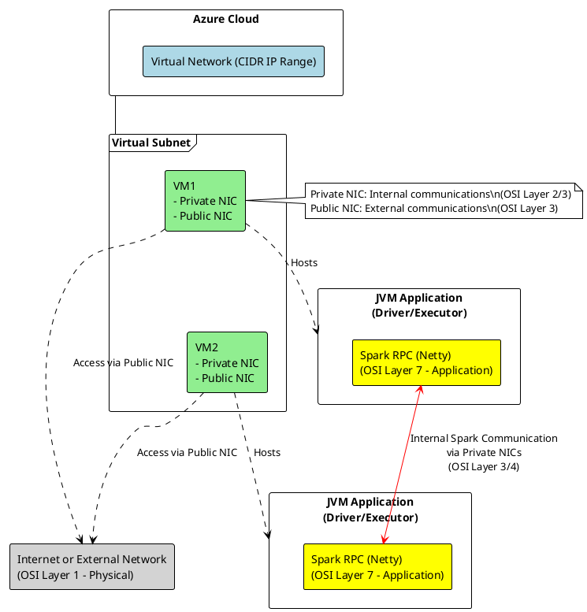

Given the complexity of the architecture involving cloud network resources, virtual machines, and the JVM processes that host Spark components, here is a simplified textual graph that describes the flow from a virtual network perspective to Spark RPC communications:

```
 +-----------------------------------------+
 |               Azure Cloud               |
 +-----------------------------------------+
                   |
                   | Virtual Network (CIDR IP Range)
                   |
 +-----------------------------------------+
 |              Virtual Subnet             |
 +-----------------------------------------+
                   |
                   | Hosts Virtual Machines (VMs)
                   |
 +-----------------v-----------------------+
 |         Virtual Machine (VM)            |
 |-----------------------------------------|
 | - Private NIC (Internal IP Address)     |
 | - Public NIC  (External IP Address)     |
 |                                         |
 |    +-------------------------------+    |
 |    |       JVM Application        |    |
 |    |       (Driver/Executor)      |    |
 |    |                               |    |
 |    |  +-------------------------+  |    |
 |    |  |   Spark Framework       |  |    |
 |    |  |                         |  |    |
 |    |  | - SparkContext          |  |    |
 |    |  | - SparkConf             |  |    |
 |    |  | - Executors             |  |    |
 |    |  |                         |  |    |
 |    |  |   +-------------------+ |  |    |
 |    |  |   | Spark RPC (Netty) |<----------------+ Network Communication
 |    |  |   +-------------------+ |  |    |       | via Virtual Network
 |    |  |                         |  |    |       |
 |    |  +-------------------------+  |    |       |
 |    |                               |    |       |
 |    +-------------------------------+    |       |
 |                                         |       |
 +-----------------------------------------+       |
                                                   |
 +-----------------v-----------------------+       |
 |         Virtual Machine (VM)            |<------+
 |-----------------------------------------|
 | - Private NIC (Internal IP Address)     |
 | - Public NIC  (External IP Address)     |
 |                                         |
 |    +-------------------------------+    |
 |    |       JVM Application        |    |
 |    |       (Driver/Executor)      |    |
 |    |                               |    |
 |    |  +-------------------------+  |    |
 |    |  |   Spark Framework       |  |    |
 |    |  |                         |  |    |
 |    |  | - SparkContext          |  |    |
 |    |  | - SparkConf             |  |    |
 |    |  | - Executors             |  |    |
 |    |  |                         |  |    |
 |    |  |   +-------------------+ |  |    |
 |    |  |   | Spark RPC (Netty) | |  |    |
 |    |  |   +-------------------+ |  |    |
 |    |  |                         |  |    |
 |    |  +-------------------------+  |    |
 |    |                               |    |
 |    +-------------------------------+    |
 |                                         |
 +-----------------------------------------+
```

This textual graph represents the hierarchical relationship between Azure's cloud resources and the Spark application's components within a JVM process, focusing on network communications:

1. **Azure Cloud** encompasses all the resources, including the virtual network that interconnects VMs.
2. **Virtual Network** facilitates communication between VMs, assigning them internal (private) and external (public) IP addresses through network interfaces (NICs).
3. **Virtual Machines (VMs)** host the JVM processes that run Spark driver and executor applications. Each VM is equipped with private and public NICs to facilitate communication.
4. **JVM Application (Driver/Executor)** contains the Spark framework, which includes the SparkContext and configuration settings.
5. **Spark RPC (Netty)** establishes communication between Spark components (e.g., driver and executors) for distributed computing tasks.

By traversing this hierarchy, you can see how network communication flows from the cloud's virtual network down to the application-level communication between Spark components, illustrating the integrated nature of cloud, virtualization, and application layers in a distributed computing environment.

In a typical cloud environment like Azure, data exchange between Spark executors (running on separate VMs within the same virtual network) primarily happens over the private network, utilizing the private NICs of the VMs. This approach is favored for several reasons:

1. **Security**: Private networks are isolated from the internet, reducing exposure to external threats.
2. **Cost**: Data transfer within the same Azure region and virtual network is usually free or less expensive than data transfer over public networks.
3. **Performance**: Private networks often offer lower latency and higher bandwidth compared to public internet connections, improving data exchange performance between executors.

The public NIC is generally used for communication that needs to reach beyond the virtual network, such as accessing external services or allowing connections from developers' machines for monitoring, deploying, or debugging purposes.

Here's a simplified textual representation:

```
[Executor A (VM1)] -- Private NIC --> [Virtual Network] -- Private NIC --> [Executor B (VM2)]
```

And if access from or to the internet or external networks is required, it would typically go through the public NIC:

```
[Executor (VM)] -- Public NIC --> [Internet or External Network]
```

This setup ensures that internal data flow, crucial for Spark's distributed computing tasks, remains efficient, secure, and cost-effective, while still allowing necessary external access when needed.

# Enhanced textual graph

Incorporating the concept of inter/outer communication via public/private network interface cards (NICs) and labeling the OSI layer for each network component, we can enhance the textual graph to represent these details clearly. Here's an updated version:

```
+-----------------------------------------+
|               Azure Cloud               |  (Layer 1-3: Physical, Data Link, Network)
+-----------------------------------------+
                   |
                   | Virtual Network (CIDR IP Range)
                   |  (Layer 3: Network)
                   |
+-----------------------------------------+
|              Virtual Subnet             |  (Layer 3: Network)
+-----------------------------------------+
                   |
                   | Hosts Virtual Machines (VMs)
                   |
+-----------------v-----------------------+
|         Virtual Machine (VM1)           |
|-----------------------------------------|
| - Private NIC (Internal IP Address)     | ----+
|    (Layer 2: Data Link, Layer 3: Network)|     |
| - Public NIC  (External IP Address)     |     | (Layer 1-3 for communication within Azure)
|    (Layer 2: Data Link, Layer 3: Network)|     |
|                                         |     |
|    +-------------------------------+    |     |
|    |       JVM Application        |    |     |
|    |       (Driver/Executor)      |    |     |
|    |                               |    |     |
|    |  +-------------------------+  |    |     |
|    |  |   Spark Framework       |  |    |     |
|    |  |                         |  |    |     |
|    |  | - SparkContext          |  |    |     |
|    |  | - SparkConf             |  |    |     |
|    |  | - Executors             |  |    |     |
|    |  |                         |  |    |     |
|    |  |   +-------------------+ |  |    +-----+ Network Communication
|    |  |   | Spark RPC (Netty) |<----------------+ via Private NIC
|    |  |   +-------------------+ |  |    |       | (Layer 4: Transport, Layer 7: Application)
|    |  |                         |  |    |       |
|    |  +-------------------------+  |    |       |
|    |                               |    |       |
|    +-------------------------------+    |       |
|                                         |       |
+-----------------------------------------+       |
                                                   |
+-----------------v-----------------------+       |
|         Virtual Machine (VM2)           |<------+
|-----------------------------------------|
| - Private NIC (Internal IP Address)     | ----+
|    (Layer 2: Data Link, Layer 3: Network)|     | (Layer 1-3 for communication within Azure)
| - Public NIC  (External IP Address)     |     |
|    (Layer 2: Data Link, Layer 3: Network)|     |
|                                         |     |
|    +-------------------------------+    |     |
|    |       JVM Application        |    |     |
|    |       (Driver/Executor)      |    |     |
|    |                               |    |     |
|    |  +-------------------------+  |    |     |
|    |  |   Spark Framework       |  |    |     |
|    |  |                         |  |    |     |
|    |  | - SparkContext          |  |    |     |
|    |  | - SparkConf             |  |    |     |
|    |  | - Executors             |  |    |     |
|    |  |                         |  |    |     |
|    |  |   +-------------------+ |  |    +-----+ Network Communication
|    |  |   | Spark RPC (Netty) | |  |    |       | via Private NIC
|    |  |   +-------------------+ |  |    |       | (Layer 4: Transport, Layer 7: Application)
|    |  |                         |  |    |       |
|    |  +-------------------------+  |    |       |
|    |                               |    |       |
|    +-------------------------------+    |       |
|                                         |       |
+-----------------------------------------+       |
```

This graph not only delineates the virtual networking setup within an Azure cloud environment but also highlights the specific OSI layers at which different components operate. This level of detail is crucial for understanding the encapsulation and flow of data from one Spark executor to another across the private network, utilizing the internal IP addresses assigned to VMs. It emphasizes the isolation and efficiency of internal communications through private NICs while acknowledging the role of public NICs for external access, all within the context of running Spark applications in a cloud-based virtual network environment.

The Spark RPC (Netty) component is labeled as operating on OSI Layer 7, the Application Layer, because it facilitates high-level application-to-application communication. Spark RPC (Remote Procedure Call) utilizes Netty, a high-performance networking framework, to enable distributed processing tasks and data exchange between Spark components like drivers and executors. This RPC mechanism is built atop Netty's network communication framework, which abstracts lower-level networking details (such as transport protocols) to allow developers to focus on application logic.

In the context of Spark and Netty:

- **Netty** provides the networking infrastructure, handling details like connection management, data encoding/decoding, and asynchronous I/O operations, which are foundational elements that span across various OSI layers, primarily the Transport (Layer 4) and Session (Layer 5) layers.
- **Spark RPC**, however, specifically utilizes Netty to implement high-level Spark-specific communication protocols and data exchange formats, making it function at the Application Layer (Layer 7). This includes operations like task submission, job scheduling, data shuffling, and heartbeats, which are essential for the coordination and operation of a Spark application.

By labeling Spark RPC (Netty) as an Application Layer component, it emphasizes its role in facilitating the end-to-end communication required for distributed computing in Spark, abstracting away the complexities of the underlying network layers.

Yes, that's a good way to frame it. Spark's RPC system, built on Netty, leverages the application layer for high-level communication protocols, often including HTTP for its web UI and REST APIs. For data transfer, such as during shuffle operations, the process encapsulates higher-level protocols within lower OSI layers, effectively tunneling through:

1. **Application Layer (Layer 7)**: Spark's RPC framework initiates communication, encoding messages and commands, potentially using HTTP for some interactions.

2. **Session Layer (Layer 6)**: Establishes, manages, and terminates sessions between applications. This layer is abstracted in the JVM's handling of connections.

3. **Transport Layer (Layer 4)**: Manages end-to-end message delivery in the network, with TCP/IP being a common protocol here for ensuring ordered and reliable delivery of the shuffle data.

4. **Network Layer (Layer 3)**: Handles routing of the data packets across the network infrastructure, using protocols like IP to reach the destination address.

5. **Data Link Layer (Layer 2) and Physical Layer (Layer 1)**: Ensure physical transmission over the medium, whether it's within the same subnet or across different network segments, facilitated by the Ethernet protocol on LANs and corresponding physical media.

So, when Spark tasks exchange shuffle data, they initiate the process at the application layer, but the actual data transfer traverses down to the transport layer for TCP/IP transmission, then back up the layers at the receiving end. This layered approach allows Spark to abstract the complexity of network communications, focusing on high-level data processing logic while relying on the underlying network stack for data delivery.



This PlantUML diagram visualizes the structure and communication pathways of a distributed Spark application deployed within the Azure Cloud environment. It highlights the network configuration, the role of virtual machines, and the method of internal and external communication. The key components and their interactions are described in bullet points:

- **Azure Cloud**: Serves as the foundational cloud platform hosting the virtual network and all associated resources.
- **Virtual Network (CIDR IP Range)**: Represents the isolated network space within Azure, providing a secure environment for resources to communicate. It's defined by a CIDR block that specifies the IP address range of the network.
- **Virtual Subnet**: A subdivision of the virtual network that contains a group of related resources, such as VMs. This segmentation helps in managing network policies and access control more granularly.
- **Virtual Machines (VM1 and VM2)**:
  - Each VM hosts a JVM application that can act as either a Spark driver or executor, depending on the Spark job's configuration.
  - VMs are equipped with Private and Public Network Interface Cards (NICs) to manage different types of network traffic:
    - **Private NIC**: Used for internal communications within the Azure virtual network, operating primarily at OSI Layers 2 (Data Link) and 3 (Network). This NIC handles traffic between Spark nodes (drivers and executors) without exposing data to the external internet.
    - **Public NIC**: Facilitates external communications with resources outside the virtual network, such as internet access or connections to external data sources and services.
- **Spark RPC (Netty)**: Represents the application layer (OSI Layer 7) communication within Spark, using Netty for efficient, asynchronous network communication. Spark RPC enables:
  - **Internal Spark Communication**: Between different Spark components (executors and drivers) through private NICs, allowing for fast data exchange and task coordination. This communication is crucial for executing distributed data processing tasks efficiently.
- **Internet or External Network**: Indicates the broader internet or other external networks that VMs can access through their public NICs. This connection is used for downloading dependencies, accessing external data sources, or interacting with cloud services outside the Azure virtual network.

This diagram succinctly captures the complex interactions within a distributed Spark application, focusing on the networking aspects that underpin reliable and secure data processing in a cloud environment.


# I know Transport{Server/Client} will go through layer 4 (TransportLayer). What would be the example of usage on Layer 7 and Layer 6 (possibly when SSL enabled?)

For Layer 7 (Application Layer) and Layer 6 (Session Layer) within the context of Spark's networking, especially when SSL/TLS is enabled, the usage examples become more nuanced, as these layers handle higher-level operations:

### Layer 7 (Application Layer):

- **HTTP for API Calls**: Spark's web UI and REST API, for instance, use HTTP(S) protocols for communication. This is where commands to monitor or control Spark jobs are issued and received at the application level.
- **Data Serialization/Deserialization**: When Spark sends or receives data, it serializes or deserializes this data (e.g., converting Java objects to JSON for REST API responses). This processing happens at the application layer.
- **Encrypted Data Transmission (with SSL/TLS)**: When SSL/TLS is enabled, the application layer (using Netty's SSL handlers, for example) initiates encryption of data before it's sent over the network, ensuring secure data transmission.

### Layer 6 (Session Layer):

- **Session Management for Secure Connections**: With SSL/TLS, a session is established that defines a secure communication channel. The session layer's role here is abstracted in JVM and handled by libraries (like Netty's SslHandler), which manage session initiation, negotiation of encryption parameters, and session resumption for repeated secure communications.
- **Authentication and Authorization**: In secure Spark environments, establishing a session might involve authentication (verifying the identity of the communicating parties) and authorization (ensuring they have permission to perform requested operations), particularly when integrated with secure data sources or services.

### Practical Considerations:

- While the OSI model neatly categorizes network functions into layers, real-world applications often blend these responsibilities. For example, Netty, as used by Spark, abstracts many lower-level networking functions but also provides utilities that work at higher levels (like SSL encryption and HTTP codecs).
- In Spark's case, Layer 6 functionalities are typically not explicitly managed by Spark developers but are handled by underlying networking libraries (like Java's SSLContext for SSL sessions) and the JVM.
- The introduction of SSL/TLS adds complexity to the network stack, impacting Layers 4 through 7, from establishing secure TCP connections to encrypting application-level data. Spark and Netty simplify these tasks for developers, abstracting much of the complexity behind configuration options and APIs.

Understanding these layers and their roles can help diagnose and troubleshoot network-related issues in distributed Spark applications, especially in secured environments where SSL/TLS is in play.


In the context of running a Spark application on an HDInsight (Hortonworks-based) cluster, the API calls you might be interested in are those related to job submission, monitoring, and management. HDInsight provides access to various services including Apache Ambari, which can be used for managing and monitoring the cluster. Here are examples of the types of API calls you might use:

1. **Job Submission**: To submit a Spark job, you might use the Livy REST API, which is a service for submitting Spark jobs from anywhere to a Spark cluster. An example API call to submit a job might look like:
   
   ```
   POST /batches
   {
     "file": "wasb:///example/jars/spark-example.jar",
     "className": "org.apache.spark.examples.SparkPi"
   }
   ```
   
   This call submits a Spark job to calculate Pi using the `SparkPi` example class.

2. **Checking Job Status**: After submitting a job, you can check its status using the Livy REST API:
   
   ```
   GET /batches/{batchId}
   ```
   
   This call retrieves the status of the job with the specified `batchId`.

3. **Listing Spark Applications**: To list all Spark applications running on the cluster, you can use the Ambari REST API:
   
   ```
   GET /api/v1/clusters/{clusterName}/services/SPARK/components/SPARK_JOBHISTORYSERVER
   ```
   
   This call lists the Spark applications managed by the JobHistoryServer component in the specified cluster.

4. **Retrieving Application Logs**: To access the logs of a specific Spark application, you might use the YARN ResourceManager's REST API:
   
   ```
   GET /ws/v1/cluster/apps/{appId}/logs
   ```
   
   This call fetches the logs for the application identified by `appId`.

5. **Cluster Management**: To manage the cluster itself, such as starting or stopping services, you can use the Ambari REST API. For example, to stop the Spark2 service:
   
   ```
   PUT /api/v1/clusters/{clusterName}/services/SPARK2
   {
     "RequestInfo": {
       "context": "Stop Spark2 Service"
     },
     "ServiceInfo": {
       "state": "INSTALLED"
     }
   }
   ```
   
   This call requests to stop the Spark2 service on the specified cluster.

These API calls provide a programmable interface to manage Spark applications and the HDInsight cluster itself. It's important to replace placeholders like `{batchId}`, `{clusterName}`, and `{appId}` with actual values relevant to your cluster and applications.
