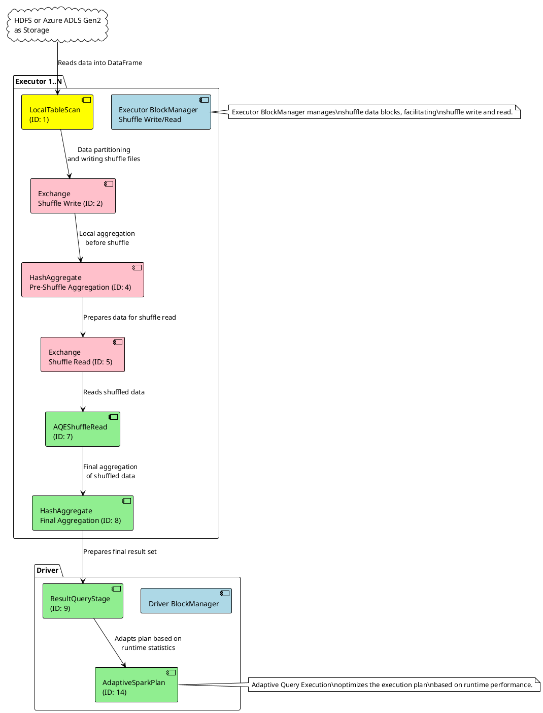
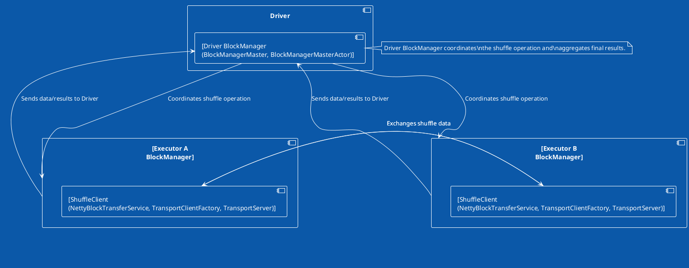

Given the detailed information and the concepts we've discussed around the shuffle operation, let's create a PlantUML diagram to illustrate the shuffle process in the context of a `groupByKey` operation in Spark. This diagram will include the key components involved in the process, from data ingestion to the final aggregation, emphasizing the shuffle's distributed nature and network communications.

### Description:

This PlantUML diagram depicts the shuffle process during a `groupByKey` operation in Spark, specifically illustrating the sequence of operations and their interactions:

- Data is read from a distributed storage system (like HDFS or Azure ADLS Gen2) into the Spark DataFrame through a `LocalTableScan`.
- The `Exchange` operation for shuffle write redistributes data across partitions, writing shuffle files locally on executors.
- A pre-shuffle `HashAggregate` operation performs local aggregation to minimize data transfer.
- Another `Exchange` operation for shuffle read ensures that each executor reads the necessary shuffle data for the next phase of aggregation.
- The `AQEShuffleRead` operation, part of Spark's Adaptive Query Execution, optimizes the shuffle read based on runtime statistics.
- A final `HashAggregate` performs the ultimate aggregation of shuffled data, leading to the result set.
- The `ResultQueryStage` and `AdaptiveSparkPlan` optimize and finalize the query execution plan.

# Info about the graph

The diagram also highlights the role of the Executor BlockManager in managing shuffle data blocks, enabling efficient shuffle write and read operations, which are crucial for the `groupByKey` operation's distributed execution.

Validating the PlantUML diagram and the components involved in the shuffle process, especially focusing on a `groupByKey` operation on a DataFrame in Spark, it's essential to accurately reflect the roles of the driver and executors in this process. Here’s a detailed breakdown to ensure our diagram aligns with Spark's architecture and operational flow:

### Executor Responsibilities in Shuffle:

1. **Executor-side Shuffle Write**:
   
   - Executors perform the map-side aggregation (`HashAggregateExec` before shuffle write).
   - They write shuffle data to local or external storage (`BlockManager` handles the data storage).

2. **Executor-side Shuffle Read**:
   
   - Post-shuffle, executors read required shuffle blocks for further processing (`BlockManager` facilitates shuffle block retrieval).
   - Executors perform the final aggregation on shuffled data (`HashAggregateExec` after shuffle read).

### Driver Responsibilities in Shuffle:

1. **Shuffle Planning and Coordination**:
   
   - The driver plans the shuffle operation, determining how data is partitioned and distributed across executors. This involves creating and optimizing the execution plan, including `Exchange` nodes for shuffle.
   - While the `ShuffleManager` component exists within the context of Spark's broader execution environment, its instantiation and coordination logic are initiated from the driver. However, the actual shuffle data management and transfer tasks are executed on the executor side.

2. **Execution Monitoring and Adaptive Query Execution (AQE)**:
   
   - The driver monitors the execution of the shuffle operation and overall job progress.
   - With AQE enabled, the driver can re-optimize the execution plan based on runtime statistics, potentially adjusting shuffle operations for efficiency.

### Reflection on PlantUML Accuracy:

Given this detailed understanding, the initial PlantUML diagram's portrayal is largely accurate with some clarifications:

- **Executors**: The diagram should clearly depict **executors handling both the shuffle write phase (pre-aggregation and writing shuffle files) and shuffle read phase (reading shuffle blocks and final aggregation)** . Components like `BlockManager` and `HashAggregateExec` are crucial here.

- **Driver**: The diagram must emphasize the driver's role in planning and coordinating the shuffle operation, including the creation of `Exchange` nodes in the physical plan and possibly overseeing the `ShuffleManager` for shuffle planning. The driver's role in monitoring and potentially adjusting the execution plan through AQE should also be represented.

In conclusion, while executors are the workhorses executing the data shuffling and aggregation, the driver orchestrates the overall process, making crucial decisions on how the shuffle is performed and monitoring the job's execution. This delineation of responsibilities should be accurately depicted in the PlantUML diagram to reflect the reality of the shuffle process in Spark accurately.

# Executor to Execturo Plantuml

In this PlantUML diagram, we have a simplified view focusing on the core components involved in the shuffle operation within a Spark application, specifically highlighting the interaction between the driver and executor block managers, as well as the shuffle process between executors A and B.

### Driver BlockManager

- **Driver BlockManager** is the central component within the driver node responsible for managing blocks of data across the entire Spark application. It contains two key subcomponents:
  - **BlockManagerMaster**: Oversees the global state of block storage across the application, including the locations of all blocks.
  - **BlockManagerMasterActor**: Utilizes the actor model to enable asynchronous communication with BlockManagers on executor nodes, coordinating tasks such as block location updates and shuffle data management.

### Executor BlockManager

- **Executor BlockManager** exists on each executor node and is responsible for storing and managing blocks of data locally. It plays a critical role in the shuffle process by handling both the reading and writing of shuffle data blocks.
- **ShuffleClient** (conceptual component): Encompasses a collection of components utilized during the shuffle process to transfer shuffle data between executors. It is not an actual class but represents the functionality provided by several components:
  - **NettyBlockTransferService**: Manages the initialization of Netty components for efficient network communication.
  - **TransportClientFactory**: Responsible for creating Netty clients that facilitate network communication for shuffle data transfer.
  - **TransportServer**: Acts as a Netty server listening for incoming shuffle data requests from other executors.
  - **NettyBlockRpcServer**: Provides Remote Procedure Call (RPC) services for operations such as opening and uploading blocks, crucial for shuffle data exchanges.

### Shuffle Data Exchange and Coordination

- The **Driver BlockManager** coordinates the shuffle operation by communicating with each executor's BlockManager, leveraging the BlockManagerMasterActor for asynchronous messaging.
- **Executor A and B's BlockManagers** engage in the shuffle data exchange process, facilitated by their respective ShuffleClients. The diagram shows bidirectional data transfer indicating that both executors A and B send and receive shuffle data as part of the shuffle read and write operations.
- The interactions between the driver and executors include not only coordination of the shuffle process but also the aggregation of final results once the shuffle and subsequent computations are complete.

This PlantUML diagram visually represents the architecture and interactions involved in managing and executing a shuffle operation within a Spark application, emphasizing the role of the Driver BlockManager in coordinating these activities and the Executor BlockManagers in executing the data exchange.

# Clarification on Shuffle Read and Shuffle Write

Let's clarify the shuffle process in Spark, particularly focusing on your questions related to the shuffle write and read phases:

### ASK1: Shuffle Write Phase

During the shuffle write phase, executors perform local pre-aggregation tasks. This pre-aggregation is part of optimizing the shuffle operation by reducing the amount of data that needs to be shuffled across the network. The specific storage location of this pre-aggregated data can vary based on the Spark configuration:

- **Local BlockManager Storage**: By default, the pre-aggregated shuffle data is stored locally on the executor's disk and managed by the executor's `BlockManager`. The `BlockManager` is responsible for storing and managing data blocks both in memory and on disk.

- **External Shuffle Service**: Spark can be configured to use an external shuffle service. When enabled, the shuffle data is stored outside of the executors in a dedicated service. This allows for the shuffle data to be retained even if the executor crashes, providing fault tolerance for long-running applications.

### ASK2: Shuffle Read Phase

For the shuffle read phase:

- **Data Fetching**: Executors fetch shuffle data from other executors or from the external shuffle service, depending on the configuration. This fetching is done based on shuffle blocks, which contain data partitioned by the key. Executors request specific shuffle blocks that contain the data they need for further processing.

- **Location of Shuffle Data**: The location from which an executor reads shuffle data can be:
  
  - Directly from the local or remote executors' storage (disk or memory), managed by the `BlockManager`.
  - From an external shuffle service if configured, which centralizes the management of shuffle data.

- **Final Aggregation**: After all the required shuffle blocks are fetched, each executor performs the final aggregation locally. This aggregation combines the fetched shuffle data with local data (if any) to produce the final result for its set of keys.

### Summary

- The **shuffle write phase** involves local pre-aggregation and storage of shuffle data either locally or in an external shuffle service, depending on the Spark configuration.
- During the **shuffle read phase**, executors fetch required shuffle blocks either from other executors or the external shuffle service. After fetching, executors perform the final aggregation locally.
- The Spark's **`RpcEnv`** primarily facilitates control messages and task execution commands between the driver and executors. The actual shuffle data transfer does not use `RpcEnv` but relies on the `BlockManager` for data management and Netty for network communication.

The shuffle process is a crucial part of Spark's distributed data processing capabilities, allowing for efficient data redistribution among executors for tasks like grouping and aggregation.
