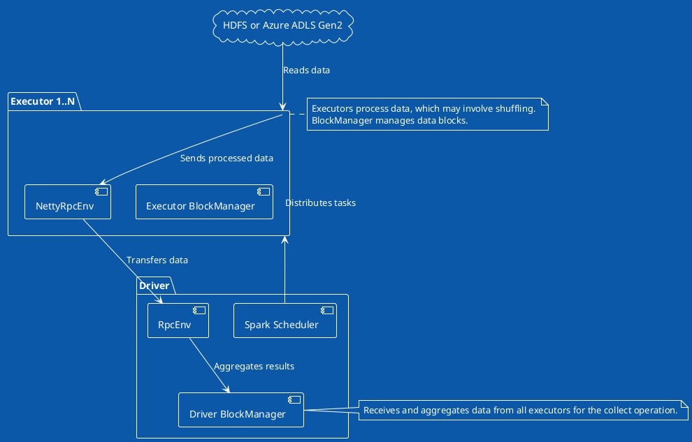

### Spark Data Processing and Collect Operation

- **Task Distribution**: Scheduler assigns tasks to executors.
- **Data Reading**: Executors read directly from HDFS/Azure ADLS Gen2.
- **Processing and Sending**: Executors process data, use NettyRpcEnv for communication.
- **Data Transfer**: Utilizes RPC for efficient data movement.
- **Result Aggregation**: Driver BlockManager aggregates collected data from all executors.

The provided PlantUML graph offers a simplified view of the data processing and communication flow in Apache Spark, especially focusing on distributed data reading and the `collect()` operation. It captures the essence of Spark's distributed computing model but abstracts away some complexities for clarity. Here's a detailed description:

### Components and Their Roles

- **Driver BlockManager**: Manages storage of data blocks in the driver, playing a crucial role in aggregating results from various executors, particularly during operations like `collect()`.

- **Spark Scheduler**: Responsible for breaking down Spark jobs into stages and tasks, distributing these tasks to executors based on data locality and other factors, ensuring efficient task execution.

- **RpcEnv in Driver**: Acts as the communication layer within the driver, facilitating data transfer and messaging between the driver and executors, leveraging Spark's RPC (Remote Procedure Call) system.

- **Executor BlockManager**: Similar to its counterpart in the driver, it manages storage of data blocks on the executor side, handling tasks such as storing, retrieving, and shuffling data blocks.

- **NettyRpcEnv in Executors**: Implements the RpcEnv functionalities using Netty for network communications, enabling efficient and asynchronous message passing and data transfer between executors and the driver.

### Data Flow and Operations

- **Task Distribution**: The Spark Scheduler, after planning the execution stages and tasks, distributes these tasks among available executors. This process is optimized to minimize data movement and leverage data locality.

- **Data Reading**: Executors directly read their respective portions of data from distributed storage systems like HDFS or Azure ADLS Gen2. This parallel reading is key to Spark's high performance, enabling it to process large datasets efficiently.

- **Data Processing and Sending**: Once the data is processed, which might include actions like filtering, mapping, or aggregating, the processed data needs to be sent back to the driver, especially during a `collect()` operation.

- **Data Transfer via RPC**: The processed data is transferred back to the driver through Spark's RPC system, specifically utilizing the NettyRpcEnv for network communication. This step involves serializing data on the executor side, transferring it over the network, and then deserializing it on the driver side.

- **Result Aggregation**: Finally, the Driver BlockManager aggregates the results received from all executors, completing the `collect()` operation. The aggregated data is then available for further processing or output.

### Overall Process

This PlantUML graph and its description underscore the distributed nature of Spark's architecture and its efficient use of RPC for communication. It highlights how Spark handles distributed data processing, from task distribution to result aggregation, ensuring scalable and efficient big data processing across a cluster. The model illustrates Spark's capability to leverage distributed storage systems and compute resources effectively, making it a powerful tool for big data analytics and processing.

In Apache Spark, how data is read and processed, particularly with regards to partitioning and where the initial read happens (driver vs. executors), depends significantly on the nature of the data source and how Spark jobs are structured. Let's explore both scenarios you mentioned: partitioned data and non-partitioned (single-block) data.

### Scenario 1: Data is Partitioned

When data is stored in a partitioned format in distributed file systems like HDFS or Azure ADLS Gen2, it aligns well with Spark's distributed computing model. Partitioned data means the dataset is divided into multiple chunks or files, potentially distributed across many nodes in the storage system.

- **Distributed Read**: Spark reads each partition of the dataset in parallel across different executors. This approach leverages the distributed nature of the storage system and Spark's computing cluster, enabling efficient parallel processing.
- **Task Parallelism**: For each partition of the dataset, Spark creates a task. These tasks are distributed to executors, which process them in parallel. The granularity of the tasks aligns with the data partitioning, enhancing the overall job performance.
- **Reduced Data Movement**: Since data is read and processed in place by the executors, there's minimal data movement across the network, reducing the I/O overhead.

### Scenario 2: Data is Not Partitioned (Single-Block Data)

In cases where the dataset is not partitioned and is stored as a single large file or a few large files, Spark's approach slightly differs.

- **Potential Bottlenecks**: Reading a large, unpartitioned dataset can become a bottleneck if the data must be processed by a single task or a few tasks, limiting parallelism. However, Spark tries to mitigate this by splitting the large file into smaller chunks if possible, based on the input format and configurations.
- **Increased Data Movement**: If the dataset cannot be effectively partitioned, there may be increased data movement as larger chunks of data are distributed to executors for processing, potentially impacting performance.

### Misconception: Data Read into the Driver

There's a common misconception that data is first read into the driver before being distributed to executors. In reality, Spark employs a more efficient approach:

- **Direct Executor Reads**: Executors directly read their assigned partitions or chunks of data from the distributed file system. This method leverages distributed storage and computing resources, avoiding the bottleneck of funneling all data through the driver.
- **Driver's Role**: The driver coordinates the overall process, such as task distribution and job scheduling, but it does not typically involve reading the data itself. The exception might be small datasets or collect actions where results are aggregated back to the driver.

Understanding these scenarios helps clarify how Spark optimizes data processing tasks, leveraging distributed storage and computing resources for scalable and efficient big data processing. Spark's design aims to maximize parallelism and minimize unnecessary data movement, whether dealing with partitioned or non-partitioned datasets.

In Spark, the behavior of data movement, especially during a `collect()` operation, primarily depends on the action being performed and the volume of data involved. Here’s a breakdown of the process:

### Data Processing and Sending

After processing tasks such as filtering, mapping, or aggregating, Spark executors handle the results in a manner optimized for efficiency and network utilization. Here's how it works:

1. **During a `collect()` Operation**: When a `collect()` operation is invoked, it signifies that the processed data should be sent back to the driver. This operation is typical in applications where the final processed dataset is small enough to fit into the driver's memory. The executors serialize the processed data and send it back to the driver using Spark's internal RPC mechanism, facilitated by the `NettyRpcEnv`.

2. **Temporary Storage/Memory**: For operations that involve shuffling (e.g., `reduceByKey`), Spark may use disk storage or memory to store intermediate data. This is where the BlockManager on each executor comes into play. The BlockManager is responsible for managing the storage of blocks of data, whether in memory or on disk. During shuffle operations, data is written to shuffle files on the local disk of the executor nodes. The shuffle files are then read by other executors that need to process that data in subsequent stages.

### How RPC is Involved

- **Direct RPC Calls**: For direct data movement back to the driver (as in `collect()`), Spark leverages its RPC system. The `NettyRpcEnv` facilitates this by handling the serialization, transfer, and deserialization of data across the network. This RPC call is not just a simple message but carries the data to be collected by the driver.

- **Shuffle Operations**: For shuffle operations, while the initial writing to shuffle files doesn’t involve RPC calls directly, the metadata about shuffle files (like locations) is communicated via Spark's internal control messages. When subsequent tasks need to fetch shuffle data, they initiate fetch requests to the appropriate executors to read the shuffle data. These fetch requests, managed by the `NettyBlockTransferService`, are a form of network communication that uses Netty for efficient data transfer, although they operate at a layer different from the general RPC messages for task scheduling and execution control.

### Summary

In essence, Spark employs a sophisticated combination of memory, disk storage, and network communication to manage data movement efficiently. For operations like `collect()`, data is directly sent back to the driver via RPC calls. For shuffle operations, while data is initially stored in temporary locations (memory or disk), the movement of shuffle data between executors for further processing involves network communication, which is optimized for efficiency and performance.

Yes, during a `collect()` operation, data from each task's partition in the executors is sent back to the driver. The process involves collecting the results of the tasks executed across multiple partitions and executors and then aggregating them into a single collection in the driver program. This operation is typically used when the dataset after processing is small enough to be handled by the driver's memory. The ordering and coordination of these operations are indeed influenced by Spark's scheduling components. Here’s how it works:

### DAGScheduler and TaskScheduler

- **DAGScheduler**: The Directed Acyclic Graph (DAG) Scheduler is responsible for converting a logical execution plan (the RDD lineage graph that defines the sequence of transformations on the data) into a physical execution plan that consists of a set of stages. Each stage contains tasks based on the shuffle boundaries. The DAGScheduler determines the sequence in which stages execute based on dependencies between them.

- **TaskScheduler**: Once the DAGScheduler has divided the job into stages, the TaskScheduler is responsible for launching tasks within those stages. The tasks are distributed to executors for execution. The TaskScheduler handles task retries in case of failures and executes tasks in parallel where dependencies allow.

### Data Collection Ordering

- **Order of Execution**: The ordering of data sent back to the driver during a `collect()` operation is inherently linked to the order of the partitions of the RDD or DataFrame being collected. Spark tasks process partitions independently and in parallel, but the results are collected in partition order.

- **Sequential Collection**: Despite parallel execution, when data from partitions is sent back to the driver, it is collected in a manner that respects the partition order. This means the final collected data in the driver will follow the sequence of partitions as they were in the RDD or DataFrame, maintaining a logical data ordering.

- **Role of Schedulers**: While the DAGScheduler and TaskScheduler primarily manage the execution order of tasks and stages rather than the ordering of collected data, the initial partitioning and task distribution impact the collected data's order. For example, if a transformation leads to a repartitioning (e.g., `repartition` or `sortBy`), the resultant partition order is what determines the data collection order during a `collect()`.

### Summary

The `collect()` operation gathers data from distributed partitions across executors back to the driver, preserving the order of the data based on partitioning. The DAGScheduler and TaskScheduler orchestrate the execution of tasks that generate this data, but the collection order is essentially determined by the RDD or DataFrame's partitioning structure. This ordered collection is crucial for operations where the relative ordering of data elements is significant for subsequent processing or analysis in the driver program.

When Spark performs a `collect()` operation, the data from each executor's task partition is indeed sent back directly to the driver without being stored temporarily elsewhere. Here's a breakdown of the process:

1. **Task Execution**: Executors execute tasks on partitions of the distributed dataset. Each task works on a portion of the data, and its results are stored in the executor's memory.

2. **Collecting Results**: Upon a `collect()` call, the results of these tasks are sent directly back to the driver. This is different from operations like `saveAsTextFile()`, where the output might be written to a distributed file system (e.g., HDFS or S3).

3. **Aggregation in Driver**: The driver aggregates the results received from all executors. Since `collect()` gathers all data into the driver's memory, it is crucial that the resulting dataset is small enough to fit into the driver's available memory to avoid out-of-memory errors.

4. **No Intermediate Storage**: There's no intermediate storage or temporary data holding area used in this process. The data moves directly from the executor's memory to the driver's memory. This direct transfer is efficient for small datasets but necessitates caution with larger datasets due to memory constraints on the driver.

5. **Implications**: Since the collected data does not get stored temporarily elsewhere, the `collect()` operation should be used judiciously, especially with large datasets. For large data volumes, consider using operations that aggregate data in a distributed manner (like `reduceByKey()`) or write the data back to a distributed storage system without collecting it all on the driver.

In summary, during a `collect()` operation, the results from each task's partition are sent directly to the driver for aggregation, without intermediate storage, making it a straightforward but potentially resource-intensive operation.
