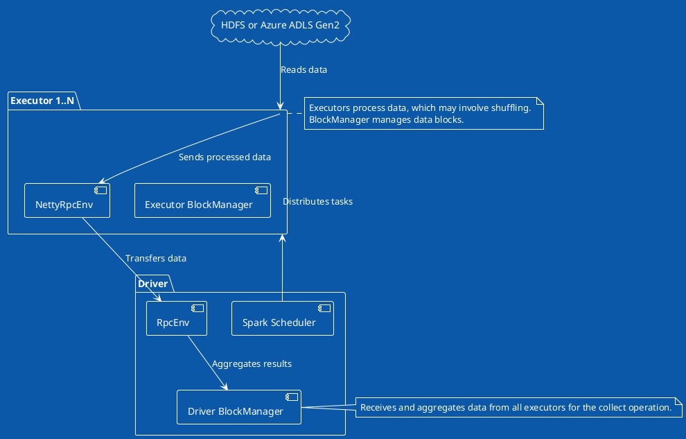

### Spark Data Processing and Collect Operation

- **Task Distribution**: Scheduler assigns tasks to executors.
- **Data Reading**: Executors read directly from HDFS/Azure ADLS Gen2.
- **Processing and Sending**: Executors process data, use NettyRpcEnv for communication.
- **Data Transfer**: Utilizes RPC for efficient data movement.
- **Result Aggregation**: Driver BlockManager aggregates collected data from all executors.

The provided PlantUML graph offers a simplified view of the data processing and communication flow in Apache Spark, especially focusing on distributed data reading and the `collect()` operation. It captures the essence of Spark's distributed computing model but abstracts away some complexities for clarity. Here's a detailed description:

### Components and Their Roles

- **Driver BlockManager**: Manages storage of data blocks in the driver, playing a crucial role in aggregating results from various executors, particularly during operations like `collect()`.

- **Spark Scheduler**: Responsible for breaking down Spark jobs into stages and tasks, distributing these tasks to executors based on data locality and other factors, ensuring efficient task execution.

- **RpcEnv in Driver**: Acts as the communication layer within the driver, facilitating data transfer and messaging between the driver and executors, leveraging Spark's RPC (Remote Procedure Call) system.

- **Executor BlockManager**: Similar to its counterpart in the driver, it manages storage of data blocks on the executor side, handling tasks such as storing, retrieving, and shuffling data blocks.

- **NettyRpcEnv in Executors**: Implements the RpcEnv functionalities using Netty for network communications, enabling efficient and asynchronous message passing and data transfer between executors and the driver.

### Data Flow and Operations

- **Task Distribution**: The Spark Scheduler, after planning the execution stages and tasks, distributes these tasks among available executors. This process is optimized to minimize data movement and leverage data locality.

- **Data Reading**: Executors directly read their respective portions of data from distributed storage systems like HDFS or Azure ADLS Gen2. This parallel reading is key to Spark's high performance, enabling it to process large datasets efficiently.

- **Data Processing and Sending**: Once the data is processed, which might include actions like filtering, mapping, or aggregating, the processed data needs to be sent back to the driver, especially during a `collect()` operation.

- **Data Transfer via RPC**: The processed data is transferred back to the driver through Spark's RPC system, specifically utilizing the NettyRpcEnv for network communication. This step involves serializing data on the executor side, transferring it over the network, and then deserializing it on the driver side.

- **Result Aggregation**: Finally, the Driver BlockManager aggregates the results received from all executors, completing the `collect()` operation. The aggregated data is then available for further processing or output.

### Overall Process

This PlantUML graph and its description underscore the distributed nature of Spark's architecture and its efficient use of RPC for communication. It highlights how Spark handles distributed data processing, from task distribution to result aggregation, ensuring scalable and efficient big data processing across a cluster. The model illustrates Spark's capability to leverage distributed storage systems and compute resources effectively, making it a powerful tool for big data analytics and processing.

In Apache Spark, how data is read and processed, particularly with regards to partitioning and where the initial read happens (driver vs. executors), depends significantly on the nature of the data source and how Spark jobs are structured. Let's explore both scenarios you mentioned: partitioned data and non-partitioned (single-block) data.

### Scenario 1: Data is Partitioned

When data is stored in a partitioned format in distributed file systems like HDFS or Azure ADLS Gen2, it aligns well with Spark's distributed computing model. Partitioned data means the dataset is divided into multiple chunks or files, potentially distributed across many nodes in the storage system.

- **Distributed Read**: Spark reads each partition of the dataset in parallel across different executors. This approach leverages the distributed nature of the storage system and Spark's computing cluster, enabling efficient parallel processing.
- **Task Parallelism**: For each partition of the dataset, Spark creates a task. These tasks are distributed to executors, which process them in parallel. The granularity of the tasks aligns with the data partitioning, enhancing the overall job performance.
- **Reduced Data Movement**: Since data is read and processed in place by the executors, there's minimal data movement across the network, reducing the I/O overhead.

### Scenario 2: Data is Not Partitioned (Single-Block Data)

In cases where the dataset is not partitioned and is stored as a single large file or a few large files, Spark's approach slightly differs.

- **Potential Bottlenecks**: Reading a large, unpartitioned dataset can become a bottleneck if the data must be processed by a single task or a few tasks, limiting parallelism. However, Spark tries to mitigate this by splitting the large file into smaller chunks if possible, based on the input format and configurations.
- **Increased Data Movement**: If the dataset cannot be effectively partitioned, there may be increased data movement as larger chunks of data are distributed to executors for processing, potentially impacting performance.

### Misconception: Data Read into the Driver

There's a common misconception that data is first read into the driver before being distributed to executors. In reality, Spark employs a more efficient approach:

- **Direct Executor Reads**: Executors directly read their assigned partitions or chunks of data from the distributed file system. This method leverages distributed storage and computing resources, avoiding the bottleneck of funneling all data through the driver.
- **Driver's Role**: The driver coordinates the overall process, such as task distribution and job scheduling, but it does not typically involve reading the data itself. The exception might be small datasets or collect actions where results are aggregated back to the driver.

Understanding these scenarios helps clarify how Spark optimizes data processing tasks, leveraging distributed storage and computing resources for scalable and efficient big data processing. Spark's design aims to maximize parallelism and minimize unnecessary data movement, whether dealing with partitioned or non-partitioned datasets.
