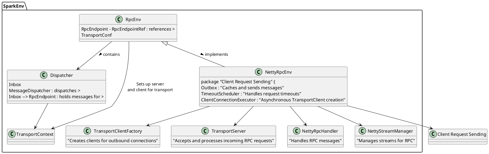
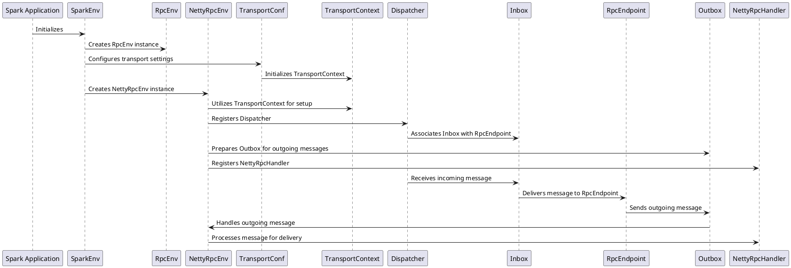
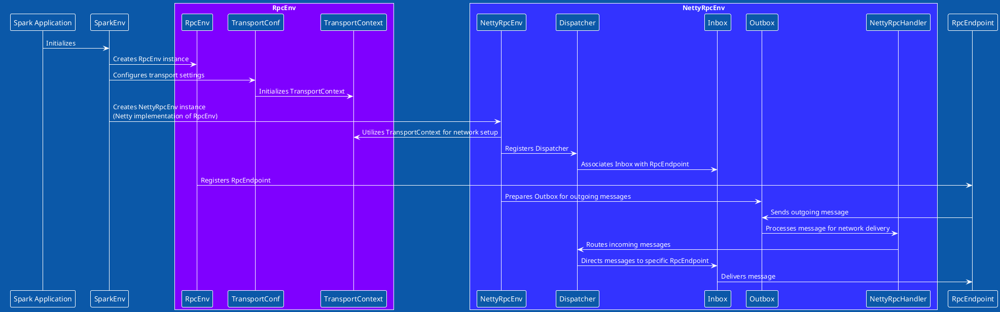

Certainly! The textual graph for the RPC environment outlined in the book can be visualized as follows, with a focus on delineating the hierarchy and flow between components:

```
[SparkEnv]
│
├── [RpcEnv]
│    │
│    ├── [RpcEndpoint] <---> [RpcEndpointRef] (References to endpoints)
│    │
│    ├── [TransportConf] (Transport configuration)
│    │
│    ├── [Dispatcher] (Routes messages to endpoints)
│    │    │
│    │    ├── [Inbox] (Holds messages for an endpoint)
│    │    └── [MessageDispatcher] (Dispatches messages from the inbox to RpcEndpoint)
│    │
│    └── [TransportContext] (Sets up server and client for transport)
│         │
│         ├── [NettyRpcHandler] (Handles RPC messages)
│         └── [NettyStreamManager] (Manages streams for RPC)
│
└── [NettyRpcEnv] (RPC environment using Netty)
     │
     ├── [TransportClientFactory] (Creates clients for outbound connections)
     │
     ├── [TransportServer] (Accepts and processes incoming RPC requests)
     │
     ├── Client Request Sending (Manages outbound messages and connections)
     │    │
     │    ├── [Outbox] (Caches and sends messages to remote endpoints)
     │    ├── [TimeoutScheduler] (Handles request timeouts)
     │    └── [ClientConnectionExecutor] (Asynchronous TransportClient creation)
     │
     └── Common Methods
          │
          ├── [EndpointRef] (Acquire references to endpoints)
          └── [Send/Ask Methods] (Communicate with remote endpoints)
```

This graph shows a high-level structure of how the Spark RPC environment is organized and how different components interact with each other. It encapsulates the establishment of communication channels (`TransportConf`), the routing of messages (`Dispatcher` and `Inbox`), the actual handling of RPC calls (`NettyRpcHandler`), and the management of streaming data (`NettyStreamManager`). The `NettyRpcEnv` extends these functionalities by managing outbound connections and messages (`

Outbox`, `TimeoutScheduler`, `ClientConnectionExecutor`) and offering a suite of methods for engaging with remote endpoints (`EndpointRef`, `Send/Ask Methods`).

Let's correct the syntax and ensure the PlantUML diagram accurately reflects the structure and relationships among `SparkEnv`, `RpcEnv`, and `NettyRpcEnv`. Here's the revised PlantUML diagram:



This corrected diagram aims to illustrate the hierarchical relationship between `RpcEnv` and `NettyRpcEnv` within the `SparkEnv`, along with the components they interact with, such as `Dispatcher`, `TransportContext`, and others. It shows that `NettyRpcEnv` implements `RpcEnv`, specifying it uses Netty for network operations and includes components for managing client requests and connections.

Certainly, let's include the `Inbox` and `Outbox` in the sequence diagram to show their roles in handling incoming and outgoing messages, respectively, within `NettyRpcEnv`. These components are crucial for managing message delivery and reception in Spark's distributed communication.



In this diagram:

- **Inbox**: Associated with a specific `RpcEndpoint`, the `Inbox` receives and queues incoming messages from the `Dispatcher`. It ensures that messages are processed in the order they're received and delivered to the appropriate `RpcEndpoint` for handling.
- **Outbox**: Responsible for managing and sending outgoing messages from an `RpcEndpoint`. The `Outbox` queues messages and works with `NettyRpcEnv` to process and deliver them to their destination.

This updated diagram provides a more comprehensive overview of how messages are routed within the Spark RPC system, highlighting the critical role of `Inbox` and `Outbox` in ensuring efficient and orderly communication between `RpcEndpoints`.

To declutter the diagram and emphasize the distinct roles within `RpcEnv` and `NettyRpcEnv`, we can categorize the related steps under these components. This approach will help to clearly differentiate the general RPC environment setup from the specific functionalities provided by `NettyRpcEnv`.



In this categorized diagram:

- The **RPC Environment Setup** section encapsulates the generic steps involved in setting up the `RpcEnv`, including the configuration of transport settings through `TransportConf` and the initialization of `TransportContext`.
- The **Netty Specifics** section focuses on components and operations unique to the `NettyRpcEnv`, such as message handling through `Dispatcher`, `Inbox`, and `Outbox`, and the specific `NettyRpcHandler` for processing network delivery.

This structured approach enhances readability by clearly separating the general RPC setup from the specifics of Netty's implementation, providing a clearer overview of the initialization and message handling processes within Spark's RPC system.

Certainly! Here's an expanded slide page description that integrates the elements of RPCEnv and NettyRpcEnv within the Spark application environment setup:

- **Spark Application Initialization and RPC Communication**
  - Initiated by `SparkEnv`, orchestrating components for distributed execution.
  - Utilizes `RpcEnv` framework to enable inter-node communication.
  - `NettyRpcEnv`, a Netty-based implementation, optimizes network interactions.
  - `TransportConf` and `TransportContext` configure and manage network settings.
  - Message delivery coordinated through `Dispatcher`, `Inbox`, and `Outbox`.
  - Essential for executing distributed tasks and managing node communications.
  - Facilitates scalable and efficient data processing across Spark clusters.

## Notes

Your UML sequence diagram accurately illustrates the relationships and interactions between `RpcEnv` and `NettyRpcEnv`, as well as their interaction with other components within a Spark application's networking layer. Here's a description based on the diagram:

---

When `SparkEnv` initializes in a Spark application, it performs several crucial steps to set up the environment necessary for the application's execution. This process involves the instantiation and configuration of various components critical for both the driver and executor functionalities within Spark's distributed computing framework. Here's a detailed breakdown of these components and their roles in a Spark application:

- **Spark Configuration (`SparkConf`):** Initialization starts with `SparkConf`, which holds all Spark settings and configurations. These settings influence the behavior of various components within `SparkEnv`.

- **RPC Environment (`RpcEnv`):** Sets up the RPC system, enabling communication between different nodes in the Spark cluster. This system is crucial for the execution of distributed tasks and coordination between the driver and executors.

- **Distributed Storage Systems:**
  
  - **Block Manager:** Manages the storage of data blocks used in computations. It handles reading, writing, and storing of data blocks both in-memory and on-disk across all nodes in the Spark cluster.
  - **Broadcast Manager:** Responsible for broadcasting large datasets or variables to all executors efficiently. This is essential for tasks that require access to common data.

- **Task Scheduling and Execution:**
  
  - **Task Scheduler:** Coordinates task scheduling and execution. It assigns tasks to executors based on data locality and available resources, optimizing performance and resource utilization.
  - **DAG Scheduler:** High-level scheduling layer that translates Spark's RDD (Resilient Distributed Dataset) operations into stages and tasks. It determines the optimal execution plan and handles failures and retries.

- **Memory Management:**
  
  - **Memory Manager:** Oversees memory allocation for storage and execution within each executor. It ensures that memory usage is optimized to balance execution speed and data caching efficiency.

- **Shuffle System:**
  
  - **Shuffle Manager:** Facilitates the shuffle of data between tasks during wide transformations (e.g., `reduceByKey`). It manages the shuffle data's partitioning, distribution, and aggregation.

- **Security:**
  
  - **Security Manager:** Handles authentication and authorization for Spark jobs. It ensures secure communication between Spark components and manages access to resources.

- **Metrics and Monitoring:**
  
  - **Metrics System:** Collects and reports various metrics related to job execution, resource utilization, and performance. This system is key for monitoring and optimizing Spark application performance.

- **Other Components:**
  
  - **Serializer:** Determines how data is serialized for network transmission and storage. Efficient serialization can significantly impact performance, especially in distributed operations.
  - **Caching and Persistence Mechanisms:** Enable data to be cached in memory or persisted to disk, accelerating data retrieval in iterative computations and fault tolerance.

By setting up these components, `SparkEnv` creates a robust environment tailored for distributed data processing. It ensures that Spark applications can efficiently execute complex computations across many nodes while managing resources, data storage, and task execution with fine-grained control and optimization.

In a Spark application, when the `SparkEnv` (Spark Environment) initializes, it sets up the necessary components for the application's execution, including the RPC (Remote Procedure Call) environment. The `RpcEnv` serves as an abstract layer that defines the framework for RPC communications within the Spark ecosystem. As part of its initialization, it requires the configuration of transport settings, which is handled by the `TransportConf` object. These settings are then used to initialize the `TransportContext`, which provides the necessary context for the network transport layer.

Given that Spark utilizes Netty for its network communications, the `SparkEnv` creates an instance of `NettyRpcEnv`, a concrete implementation of `RpcEnv` that leverages the Netty library for efficient and scalable network communications. The `NettyRpcEnv` utilizes the previously set up `TransportContext` for its network configuration and setup.

Within the `NettyRpcEnv`, several key components are initialized to manage the flow of messages between RPC endpoints. The `Dispatcher` component is registered to manage the routing of incoming and outgoing messages. Each RPC endpoint is associated with an `Inbox`, which is responsible for receiving incoming messages, and an `Outbox`, which is used to prepare and send outgoing messages.

When a `RpcEndpoint` needs to send a message, it places the message in its `Outbox`. The `Outbox` then processes the message for network delivery, passing it to the `NettyRpcHandler`. The `NettyRpcHandler` is responsible for the low-level processing of messages, including serialization, deserialization, and communication over the network.

Incoming messages are routed by the `NettyRpcHandler` to the `Dispatcher`, which directs the messages to the appropriate `RpcEndpoint` through its `Inbox`. The `Inbox` receives the message and delivers it to the `RpcEndpoint` for processing.

This flow demonstrates the seamless integration between the abstract `RpcEnv` and its concrete implementation `NettyRpcEnv`, facilitated by the `TransportContext` and other networking components. It highlights how Spark abstracts its RPC mechanism to allow for efficient communication between components in a distributed computing environment, leveraging the power and scalability of the Netty library.

---

This description encapsulates the relationships and message flow depicted in your UML sequence diagram, highlighting the roles and interactions of `RpcEnv`, `NettyRpcEnv`, and related components within Spark's networking layer.

Certainly! Here are the notes structured for a presentation on the relationships between `RpcEnv` and `NettyRpcEnv` within the Apache Spark architecture:

- **Introduction to Spark Networking**
  
  - Brief overview of Spark's distributed computing model.
  - Importance of efficient network communication for distributed processing.

- **Understanding RpcEnv**
  
  - `RpcEnv` acts as the abstract base for Spark's RPC system.
  - Provides a framework for remote procedure calls within Spark.

- **Role of TransportConf and TransportContext**
  
  - `TransportConf` configures network settings critical for RPC communications.
  - `TransportContext` utilizes these settings to establish the network environment.

- **NettyRpcEnv: A Concrete Implementation**
  
  - Introduction to `NettyRpcEnv`, Spark's Netty-based RPC environment.
  - Highlights Netty's efficiency and scalability in network communication.

- **Dispatcher and Message Routing**
  
  - The `Dispatcher` component manages the routing of messages to/from RPC endpoints.
  - Essential for directing messages to the correct destination within Spark.

- **Inbox and Outbox Mechanisms**
  
  - Every `RpcEndpoint` has an associated `Inbox` for incoming messages.
  - `Outbox` manages the preparation and sending of outgoing messages.

- **Sending Messages with Outbox**
  
  - Process of sending a message starts with placing it in the `Outbox`.
  - `Outbox` forwards the message to `NettyRpcHandler` for network delivery.

- **Processing Incoming Messages**
  
  - `NettyRpcHandler` processes incoming messages, handling low-level network tasks.
  - Routes incoming messages to the `Dispatcher`, which then directs them to the appropriate `Inbox`.

- **Delivery to RpcEndpoint**
  
  - The `Inbox` receives and delivers the message to its `RpcEndpoint` for processing.
  - Ensures that messages are handled by the correct component within Spark.

- **Summary**
  
  - `RpcEnv` and `NettyRpcEnv` provide a robust foundation for Spark's RPC communications.
  - Integration of `TransportContext`, `Dispatcher`, `Inbox`, and `Outbox` facilitates efficient message flow.
  - Netty's use in `NettyRpcEnv` enhances Spark's network communication efficiency and scalability.

These notes are designed to guide a presentation on how Spark manages RPC communications through the abstract `RpcEnv` and its Netty implementation, `NettyRpcEnv`, highlighting key components and their interactions.

-----

The subsections within 5.3 of the book "The Art of Spark Kernel Design: Architecture Design and Implementation" describe the components and functionality of Spark's RPC environment. While each subsection addresses a specific topic, they are interconnected and collectively describe how the RPC system operates within Spark. Here is a summary of their relationships and an attempt to provide a textual representation of the flow:

1. **RPC Environment Setup (5.3):**
   
   - Introduction to RpcEnv as a replacement for Akka in Spark 2.x.
   - Details on how RpcEnv is created and configured within SparkEnv.
   - Entry point that contextualizes the following sections.

2. **RPC Endpoints (5.3.1):**
   
   - Defines RpcEndpoint as an abstraction over entities that handle RPC requests.
   - RpcEndpoints are instantiated and registered within RpcEnv, setting up the framework for message handling.

3. **RPC Endpoint References (5.3.2):**
   
   - Introduces RpcEndpointRef which acts as a reference or proxy to an RpcEndpoint.
   - Enables remote invocation and message passing to RpcEndpoints.

4. **Transport Context (5.3.3):**
   
   - Explains the creation of TransportConf and its role in setting up the TransportContext.
   - TransportContext enables the creation of server and client components necessary for communication.

5. **Message Dispatcher (5.3.4):**
   
   - Describes the Dispatcher, which routes RPC messages to the correct RpcEndpoint for processing.
   - Acts as the central message routing component in the RpcEnv.

6. **Transport Server Creation (5.3.7):**
   
   - Covers the instantiation of TransportServer that listens and responds to incoming RPC requests.
   - Connects the server-side components discussed earlier.

7. **Client-Side Request Sending (5.3.8):**
   
   - Discusses how RpcEnv sends requests to RpcEndpoints, utilizing the TransportClient.
   - Relates to the client-side mechanisms for invoking RPC functionality.
   
   The subsections within Chapter 5.3 of the book "The Art of Spark Kernel Design: Architecture Design and Implementation" appear to describe the RPC environment in Spark, with each subsection focusing on a particular aspect of the environment. Although they cover different topics, these subsections are interconnected and collectively describe the Spark RPC mechanism in detail. Below is an overview of how these topics relate to each other and a textual representation of their relationships:
   
   **5.3.1 RPC Endpoint (RpcEndpoint):** This introduces the basic abstraction for RPC communication within Spark. It represents entities that can receive and process RPC messages.
   
   **5.3.2 RPC Endpoint Reference (RpcEndpointRef):** Describes how references to RPC Endpoints are managed. This allows sending messages to, and making calls on, these endpoints in a location-transparent manner, similar to how Akka manages ActorRefs.
   
   **5.3.3 Transport Configuration (TransportConf):** Details the configuration class for the RPC framework, critical for both the client and server sides of RPC communications.
   
   **5.3.4 Message Dispatcher (Dispatcher):** Explains the dispatcher component that routes messages to their respective RpcEndpoints.
   
   **5.3.5 Transport Context (TransportContext):** Outlines how the TransportContext provides the foundation for server (TransportServer) and client (TransportClientFactory) capabilities in the RPC environment.
   
   **5.3.6 Transport Client Factory (TransportClientFactory):** Covers the creation of a factory that produces clients (TransportClient) used to send RPC messages to endpoints.
   
   **5.3.7 Transport Server (TransportServer):** Illustrates the role of TransportServer in accepting and processing incoming RPC requests.
   
   **5.3.8 Client Request Sending:** Discusses how clients send messages and make RPC calls to remote endpoints, managing timeouts and async handling.
   
   **5.3.9 Common Methods in NettyRpcEnv:** Details frequently used methods in the NettyRpcEnv class, which is central to RPC communication in Spark.The subsections within Chapter 5.3 of the book "The Art of Spark Kernel Design: Architecture Design and Implementation" appear to describe the RPC environment in Spark, with each subsection focusing on a particular aspect of the environment. Although they cover different topics, these subsections are interconnected and collectively describe the Spark RPC mechanism in detail.  

Relationship Summary:

- The `RpcEnv` serves as the entry point for the RPC environment, with its creation and configuration managed within `SparkEnv`.
- `RpcEndpoints` represent the entities that process RPC messages, and `RpcEndpointRef` provides the references to interact with these endpoints.
- `TransportConf` provides the necessary configuration for the networking layer within the RPC environment.
- The `Dispatcher` manages the routing of messages to the appropriate `RpcEndpoint` within the system.
- The `TransportContext` establishes the context necessary for creating `TransportServer` (for serving requests) and `TransportClientFactory` (for sending requests).
- The `TransportClientFactory` produces `TransportClient` instances that are used by `NettyRpcEnv` for outbound communication.
- The `TransportServer` listens for and processes incoming RPC requests.
- Client request sending involves the use of `Outbox` to cache and dispatch messages to remote endpoints, with mechanisms in place for handling timeouts and managing asynchronous connections.
- Common methods in `NettyRpcEnv` provide functionality for creating endpoint references, and sending and asking messages, which are fundamental to Spark's RPC operations.

Each subsection in 5.3 builds upon the other, creating a complete picture of the RPC mechanism in Spark, including the lifecycle of messages from creation to processing, both locally and across the network.

**Chapter 5.3: RPC Environment Summary**

This section of the book outlines the architecture and implementation of Spark's RPC environment, introduced in Spark version 2.x.x. The RpcEnv component is a pivotal addition to Spark, replacing the use of Akka from earlier versions. While Akka provided capabilities like message sending, synchronous and asynchronous remote calls, routing, persistence, supervision, and at-least-once delivery guarantees, with its removal, the RpcEnv needed to encompass these mechanisms as well.

**Creation of RpcEnv:**
RpcEnv is created within SparkEnv with a system name that varies if the application is a Driver (`sparkDriver`) or an Executor (`sparkExecutor`). The creation process involves:

1. Creating `RpcEnvConfig` which holds configuration details for RpcEnv.
2. Instantiating `NettyRpcEnvFactory` to create an `RpcEnv`.

**Key Components within RpcEnv:**

- **TransportContext:** Central to the RPC mechanism, essential for creating both server (`TransportServer`) and client factories (`TransportClientFactory`), and supporting SocketChannel pipeline setup.
- **TransportConf:** Configuration for the transport context.
- **RpcHandler:** Handles processing of RPC messages sent via the TransportClient's `sendRPC` method.
- **Dispatcher:** Manages routing of RPC messages to the appropriate RpcEndpoint for processing.

**RpcEndpoint and RpcEndpointRef:**
RpcEndpoint is a critical concept within NettyRpcEnv, serving as the abstraction over entities that operate on the RPC framework. RpcEndpointRefs represent references to RpcEndpoints, similar to how Akka has ActorRef references to Actors.

**Handling of Messages:**
Messages to RpcEndpoints are encapsulated as `InboxMessage` types and managed within an `Inbox`. The Dispatcher delegates messages to the correct RpcEndpoint's Inbox for asynchronous processing.

**NettyRpcEnv and Stream Management:**
The NettyRpcEnv utilizes `NettyStreamManager` to provide stream management capabilities, replacing the HttpFileServer used in Spark 1.x.x versions. The `NettyRpcHandler` handles the RPC messages received over the network, and the `TransportServer` provides server capabilities.

**Sending Requests from the Client Side:**
The client-side components involved in sending requests include a timeout scheduler, a connection executor for TransportClient, and `Outbox` to cache and send `OutboxMessage` instances. Messages are serialized and sent over the network, with the Dispatcher posting messages to the remote RpcEnv.

**Relationship to Spark RPC System:**
The chapter's description indicates that the architecture is built upon the lower-level networking infrastructure (`org.apache.spark.network`) and leverages Netty for stream management and message handling. The RpcEnv component adds a layer of abstraction over this to provide a full-fledged RPC framework.

This chapter explains how Spark's RPC system is tightly integrated with its networking components, using Netty's efficient IO and stream management capabilities to provide the necessary functionality for distributed message passing and processing that was previously handled by Akka. The RpcEnv, alongside the Dispatcher, TransportContext, and associated configurations, encapsulates the networking logic to create a robust and flexible RPC system within Spark.
