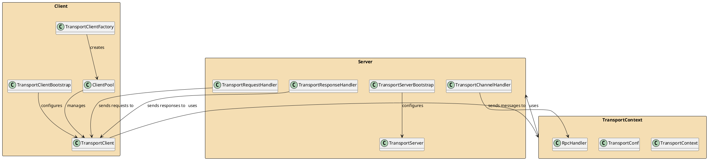
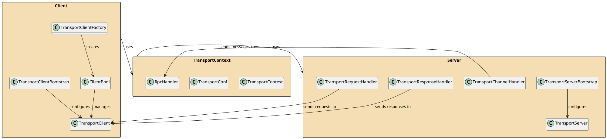
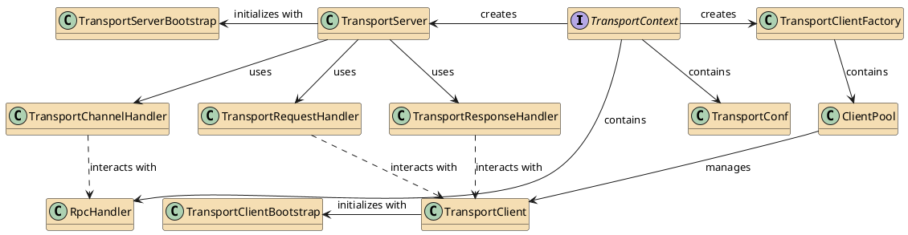

The description from "Spark内核设计的艺术：架构设计与实现" gives a detailed view of Spark's RPC framework. Here's a summary of the RPC framework in Spark, with key components derived from the `org.apache.spark.network` package:

**Spark RPC Framework Summary:**

- **TransportContext**: Holds context information used to create `TransportClientFactory` and `TransportServer`, including configuration (`TransportConf`) and message handling (`RpcHandler`).
- **TransportConf**: Configuration information for the transport context.
- **RpcHandler**: Handles messages sent by calling the `sendRPC` method on the `TransportClient`.
- **TransportClientFactory**: Factory class for creating `TransportClient` instances. It houses a pool of clients (`ClientPool`) for each socket address for efficient connection reuse.
- **ClientPool**: A pool of `TransportClient` instances maintained between two peer nodes for efficient communication.
- **TransportClient**: The client side of the RPC framework, responsible for efficiently transmitting large amounts of data split into chunks.
- **TransportClientBootstrap**: A bootstrap executed on the client when the server responds to a connection.
- **TransportServer**: The server side of the RPC framework, offering efficient and low-level streaming services.

**Additional Network Components:**

- **TransportRequestHandler**: Handles requests from the client and returns responses after data is written.
- **TransportResponseHandler**: Handles responses from the server and manages callbacks for the requesting clients.
- **TransportChannelHandler**: Acts as a proxy for requests handled by `TransportRequestHandler` and responses handled by `TransportResponseHandler`, integrating with the transport layer.
- **TransportServerBootstrap**: A bootstrap executed on the server when a client connects.

**Textual Graph of Spark RPC Framework:**

```
  TransportContext
   /             \
  /               \
TransportConf    RpcHandler
  |                |
  v                v
TransportClientFactory     TransportServer
  |                       /           |           \
  |                      /            |            \
ClientPool   TransportRequestHandler  |   TransportServerBootstrap
  |                                  |
  |                                  |
TransportClient               TransportChannelHandler
  |
  |
TransportClientBootstrap
```

**Revised Summary**:
The RPC framework in Spark is essentially a network communication infrastructure that enables efficient data exchange between client and server within the distributed environment. `TransportContext` is central to the RPC framework, providing the necessary context for creating both client and server components. The configuration is managed by `TransportConf`, and `RpcHandler` is responsible for handling RPC messages. Factories and bootstraps for both client (`TransportClientFactory` and `TransportClientBootstrap`) and server (`TransportServer` and `TransportServerBootstrap`) streamline the initialization and connection processes. Client pools manage active connections, and handlers (`

TransportRequestHandler` and `TransportResponseHandler`) deal with the incoming and outgoing requests and responses, ensuring smooth data transfer and RPC communication.

Here's a textual graph that represents the structure and relationships of the Spark RPC framework components, with the `org.apache.spark.network` package as the foundational layer:

```
  [TransportContext]---[TransportConf]
        |                     |
        |                     |
  [RpcHandler]         [TransportClientFactory]---[ClientPool]---[TransportClient]
        |                     |                     |                     |
        |                     |                     |            [TransportClientBootstrap]
        |                     |                     |
        |                     |------------[TransportServer]---[TransportServerBootstrap]
        |                                     |
        |----------------------------[TransportChannelHandler]
```

Certainly! Here are two versions of the PlantUML script: one with vertical stacking (client on top, transportcontext in the middle, server on the bottom) and one with horizontal alignment (client to the left, transportcontext in the middle, server on the right).

### Vertical Stacking (Top to Bottom):



### Horizontal Alignment (Left to Right):



You can choose the arrangement that best fits your presentation layout. The vertical stacking will provide a top-down view of the framework, whereas the horizontal alignment will give a left-to-right flow of interactions.

**Slide: Spark RPC Framework Relationships**

- **Client to Context**: Initiates and maintains communication channels.
- **Context**: Central orchestrator, linking clients and servers.
- **Context to Server**: Sets up servers, manages incoming RPC requests.

**Notes: Detailed Explanation**

- **TransportContext**: The core component of Spark's RPC framework, `TransportContext`, acts as the orchestration center. It is responsible for creating and setting up both the `TransportClientFactory` and `TransportServer`. It holds the `TransportConf` for configuring the network properties and `RpcHandler` for processing the RPC messages.
  
  - `TransportConf`: Provides the necessary network settings and parameters that govern the communication protocols and performance optimizations for Spark's networking layer.
  
  - `RpcHandler`: This class is pivotal as it handles incoming RPC calls. When a message is received, the `RpcHandler` determines the appropriate action or response, ensuring that the Spark components can communicate effectively, even when distributed across a cluster.

The relationships between these components reflect the distributed nature of Spark, where efficient communication and management of data and tasks are essential. The `TransportContext` is integral to the RPC mechanism, directly interacting with both the client and server components to facilitate this communication. It manages configuration, establishes the server environment, and ensures the correct handling of RPC requests.

This graph shows how `TransportContext` relies on `TransportConf` for configuration parameters and on `RpcHandler` for handling the RPC messages. `TransportClientFactory` creates `TransportClient` instances managed within `ClientPool`, and the clients are set up using `TransportClientBootstrap`. The `TransportServer` is created from the same `TransportContext`, using `TransportServerBootstrap` for server setup, and utilizes `TransportChannelHandler` to integrate request and response handling into the transport layer.

These components together make up Spark's robust RPC framework, designed for efficient, scalable, and reliable distributed computing.

Certainly! Below is a PlantUML script that corresponds to the revised textual graph of the Spark RPC framework components:



You can use this script with any PlantUML renderer to create a visual diagram of the Spark RPC framework. The script defines the components, their relationships, and a basic layout for the diagram. The `hide methods` line is included to focus on the structure rather than the internal details of the components. The skin parameters are used to add some basic styling to the diagram.
