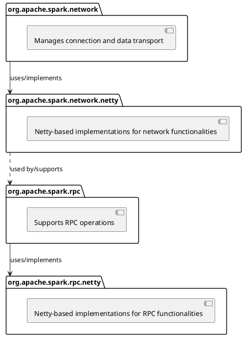
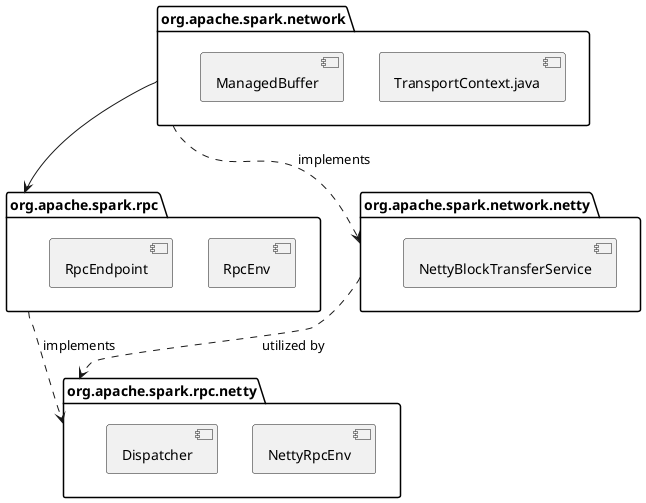

Based on the class files structure and the functionalities provided by each package as described, here's a detailed explanation of the relationships among the three mentioned Spark packages:

1. **`org.apache.spark.network`**: This package forms the core of Spark's network layer, providing foundational functionalities for managing connections and data transport. It includes critical components like `TransportContext.java`, which plays a pivotal role in initializing the network configuration and establishing communication channels. The package is designed to handle low-level network communication, data streaming, and file management, essential for Spark's distributed computing capabilities.

2. **`org.apache.spark.rpc`**: The RPC (Remote Procedure Call) package builds upon the network layer to support higher-level RPC operations. This package defines the abstractions and interfaces necessary for enabling remote method invocation across Spark components. It facilitates communication between distributed nodes in a Spark cluster, allowing them to perform coordinated operations and share state as needed. The package includes classes like `RpcEnv` and `RpcEndpoint`, which are key to establishing and managing the RPC environment within Spark.

3. **`org.apache.spark.network.netty` and `org.apache.spark.rpc.netty`**: These packages provide Netty-based implementations for the functionalities abstracted in `org.apache.spark.network` and `org.apache.spark.rpc`, respectively. They leverage Netty, a high-performance, asynchronous event-driven network application framework, to efficiently implement the required networking and RPC functionalities.
   
   - **`org.apache.spark.network.netty`**: Implements the network communication mechanisms defined in `org.apache.spark.network` using Netty. This includes optimized data transport services, such as the `NettyBlockTransferService`, which is responsible for efficient block data transfers within the cluster.
   
   - **`org.apache.spark.rpc.netty`**: Provides the Netty-based implementation of Spark's RPC system. It utilizes Netty's capabilities to implement the RPC communication outlined in `org.apache.spark.rpc`, ensuring efficient and reliable messaging. The package contains classes like `NettyRpcEnv`, which sets up the Netty-specific environment for RPC operations.

**Relationship Summary**:

- **`org.apache.spark.network`** lays the groundwork for network communication within Spark.
- **`org.apache.spark.rpc`** builds on this foundation to enable high-level RPC operations critical for distributed processing.
- **`org.apache.spark.network.netty`** and **`org.apache.spark.rpc.netty`** specialize these layers with Netty's efficient networking capabilities, providing optimized implementations tailored to Spark's requirements.

These relationships illustrate how Spark utilizes a layered architecture to separate concerns between low-level network management and high-level RPC functionalities, with Netty serving as the underlying framework that powers both aspects for enhanced performance and scalability.

Certainly, here's a textual representation of the relationships among the packages based on their functionalities and the class file structure within Spark 3.4:

```
                  +--------------------------------+
                  | org.apache.spark.network       |
                  | - Manages connection           |
                  | - Data transport               |
                  +--------------------------------+
                             |
                             | uses/implements
                             v
  +-------------------------------------------------------------+
  | org.apache.spark.network.netty                              |
  | - Netty-based implementations for network functionalities   |
  +-------------------------------------------------------------+
                             |
                    used by / supports
                             |
                             v
                  +--------------------------------+        +--------------------------------+
                  | org.apache.spark.rpc          |        | External or Spark's own         |
                  | - Supports RPC operations     | <------| higher-level functionalities    |
                  +--------------------------------+        | and components                  |
                             |                              +--------------------------------+
                             | uses/implements
                             v
  +-------------------------------------------------------------+
  | org.apache.spark.rpc.netty                                  |
  | - Netty-based implementations for RPC functionalities       |
  +-------------------------------------------------------------+
```

**Explanation**:

- **`org.apache.spark.network`**: Serves as the foundation, handling the essential network communication tasks.
- **`org.apache.spark.network.netty`**: Provides Netty-based implementations specifically for the network layer, enhancing performance and efficiency.
- **`org.apache.spark.rpc`**: Relies on the network layer to facilitate RPC operations, which are crucial for communication in distributed processing.
- **`org.apache.spark.rpc.netty`**: Implements the RPC layer functionalities using Netty, ensuring optimized communication for RPC operations.
- **External or Spark's own higher-level functionalities and components**: These might not directly interact with the network and RPC layers but depend on the abstractions and functionalities they provide.

This structure showcases a clear separation of concerns and a modular architecture within Spark, allowing for efficient and scalable distributed computing.

Certainly! Below is a PlantUML diagram that visually represents the relationships among the Spark packages and their functionalities, as previously described in the textual graph:



This PlantUML diagram describes:

- The base package `org.apache.spark.network`, which is foundational for network communication.
- The `org.apache.spark.network.netty` package that implements network functionalities using Netty, enhancing the base network capabilities.
- The `org.apache.spark.rpc` package for RPC operations, which builds upon the network layer.
- The `org.apache.spark.rpc.netty` package, providing Netty-based implementations for the RPC layer, optimizing RPC communication.

The arrows indicate the direction of dependency or implementation, showcasing how the Netty-based implementations extend and optimize the functionalities provided by the `org.apache.spark.network` and `org.apache.spark.rpc` packages.

The PlantUML diagram you've provided outlines a basic hierarchy and relationship between the packages involved in Spark's network and RPC systems. However, to fully capture the intricacies of their interactions, especially based on the Spark 3.4 compiled classes you listed, a few adjustments and additions are necessary.

1. **Inter-package Dependencies**: Your diagram correctly shows that `org.apache.spark.rpc` depends on `org.apache.spark.network` and that both `org.apache.spark.rpc.netty` and `org.apache.spark.network.netty` are extensions or implementations specific to Netty within their respective domains. However, it's also crucial to highlight that `org.apache.spark.network.netty` provides the Netty-based implementation for low-level network communication used by the RPC system, including `org.apache.spark.rpc.netty`.

2. **Functional Roles**:
   
   - `org.apache.spark.network`: This is the foundation of Spark's network module, handling low-level network communication, data transport, and I/O operations.
   - `org.apache.spark.network.netty`: Implements the functionalities defined in `org.apache.spark.network` using Netty, optimizing for efficient data transfer and connection management.
   - `org.apache.spark.rpc`: Defines the abstractions for Spark's RPC system, allowing high-level communication across Spark components.
   - `org.apache.spark.rpc.netty`: Provides the Netty-based implementation for the RPC system, leveraging `org.apache.spark.network.netty` for its underlying communication needs.

3. **Missing Elements and Details**:
   
   - **Direct Interaction**: The diagram could more explicitly represent that `org.apache.spark.rpc.netty` not only depends on `org.apache.spark.rpc` but also directly interacts with or utilizes `org.apache.spark.network.netty` for networking capabilities.
   - **Utility and Common Classes**: Your file listing includes important utility and common classes within `org.apache.spark.network`, like `TransportContext.java`, which are pivotal in initializing and configuring the network components for both RPC and general network communication. These foundational classes enable the setup and customization of the network environment in which both data transport and RPC communication occur.

Considering these points, an enhanced version of your PlantUML diagram might look like this:



**Key Adjustments**:

- Added specific classes like `TransportContext.java` in `org.apache.spark.network` to highlight their central role.
- Illustrated that `org.apache.spark.network.netty` is not just related to `org.apache.spark.network` but implements its functionalities using Netty.
- Clarified that `org.apache.spark.rpc.netty` utilizes `org.apache.spark.network.netty` directly, indicating a closer relationship than just a hierarchical one.

This revised diagram provides a clearer view of the dependencies and interactions among Spark's network and RPC components, especially emphasizing the role of Netty in enabling efficient communication within Spark's distributed computing environment.
