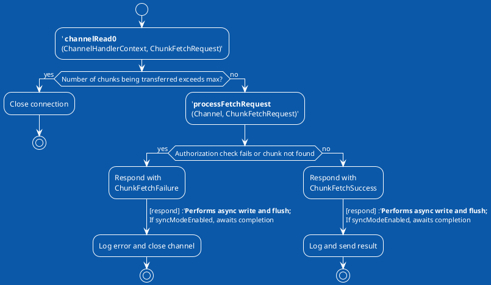

# An explanation on `initializePipeline`

The `initializePipeline` method in `TransportContext.java` is crucial for setting up the Netty channel pipeline, which is fundamental for handling network communication in Spark's transport layer. This method is designed to initialize a client or server Netty Channel Pipeline with a series of handlers that manage the encoding/decoding of messages and the processing of requests or responses. Here's a breakdown of its key functionalities and components:

1. **Channel Handler Creation**: It starts by creating a `TransportChannelHandler` for the given channel and RPC handler using the `createChannelHandler` method. This handler plays a central role in managing the communication between a Spark application's components.

2. **Pipeline Configuration**: The method configures the Netty channel pipeline with various handlers:
   
   - An optional logging handler for debugging.
   - An encoder (`ENCODER`) for serializing messages to be sent.
   - A frame decoder (`TransportFrameDecoder`) for splitting received data into frames.
   - A decoder (`DECODER`) for deserializing received messages.
   - An `IdleStateHandler` for detecting connection timeouts.
   - The `TransportChannelHandler` (`channelHandler`) for managing request or response messages.

3. **Chunk Fetch Request Handling**: For shuffle operations, a special handler (`ChunkFetchRequestHandler`) is optionally added to the pipeline to manage chunk fetch requests. This handler is only added if the configuration specifies a separate event loop group for handling chunk fetch requests, which can help in throttling the number of worker threads blocked on writing responses for chunk fetch messages.

4. **Error Handling**: The method includes error handling to log and re-throw any runtime exceptions that occur during the pipeline initialization process.

In summary, the `initializePipeline` method is responsible for preparing a Netty channel for Spark's network communication by setting up a series of encoders, decoders, and handlers that enable efficient and reliable message processing between Spark components. This setup is essential for both RPC communication and data transfer operations, such as fetching shuffle data chunks, within Spark's distributed computing environment.

# An explanation on `createChannelHandler`

The `createChannelHandler` method in the `TransportContext` class plays a crucial role in Spark's network layer by creating a `TransportChannelHandler`, which is a comprehensive handler for both request messages and response messages within a Netty channel. Here's an overview of its implementation and purpose:

### Implementation Overview:

- **TransportResponseHandler**: This handler is instantiated to manage response messages. It is responsible for handling responses to requests made by this client.
- **TransportClient**: An instance of `TransportClient` is created and associated with the channel. This client is used to send requests and handle responses.
- **ChunkFetchRequestHandler (optional)**: If the configuration does not separate chunk fetch requests into a different event loop, a `ChunkFetchRequestHandler` is created. This handler is responsible for processing chunk fetch requests for shuffle data, allowing for efficient data transfer.
- **TransportRequestHandler**: This is the main handler for processing incoming requests. It uses the `TransportClient` and `RpcHandler` to handle requests and to send responses.
- **TransportChannelHandler**: A `TransportChannelHandler` is then created, encapsulating the `TransportClient`, `TransportResponseHandler`, and `TransportRequestHandler`, along with configuration details such as connection timeout and whether to close idle connections.

### Purpose:

- **Central Handling of Network Communication**: The `createChannelHandler` method constructs a unified handler (`TransportChannelHandler`) that integrates both the sending of requests and the processing of incoming messages. This design simplifies the management of network communication in Spark's distributed environment.
- **Flexibility in Request Handling**: By creating separate handlers for different types of network operations (e.g., request handling, response handling, and chunk fetch request handling), the method provides flexibility and efficiency in how messages are processed. This is particularly important for optimizing shuffle operations, where efficient data transfer is critical for performance.
- **Configuration and Optimization**: The inclusion of configuration parameters (such as connection timeout and the option to close idle connections) in the `TransportChannelHandler` allows for fine-tuned control over network behavior. This can help optimize network resource usage and improve the reliability of communication between Spark components.
- **Simplification of Netty Pipeline Configuration**: By encapsulating the creation of these handlers within a single method, `createChannelHandler` simplifies the process of configuring the Netty pipeline. This reduces the complexity of setting up network communication within Spark.

In summary, the `createChannelHandler` method is essential for setting up efficient and configurable network communication within Spark's distributed computing framework. It achieves this by creating a composite handler that manages requests, responses, and data transfers in a streamlined and optimized manner.

# PlantUML of `ChunkFetchRequestHander`

# `ChunkFetchRequestHandler` overview

The `ChunkFetchRequestHandler` class in Apache Spark is a specialized Netty `SimpleChannelInboundHandler` for handling `ChunkFetchRequest` messages. This class is critical for the efficient transfer of chunked data between a Spark server and its clients, particularly in the context of shuffle operations. Here's a detailed overview of its methods and their purposes:

### Methods Overview

1. **constructor(TransportClient client, StreamManager streamManager, Long maxChunksBeingTransferred, boolean syncModeEnabled)**:
   
   - Initializes a new instance of `ChunkFetchRequestHandler` with the specified parameters. It's responsible for setting up the handler with a reference to the `TransportClient`, `StreamManager`, and configuration for maximum chunks being transferred and whether synchronous mode is enabled.

2. **exceptionCaught(ChannelHandlerContext ctx, Throwable cause)**:
   
   - Overrides the `exceptionCaught` method from `SimpleChannelInboundHandler`. This method is called when an exception is thrown during the channel pipeline execution. It logs a warning with the remote address causing the exception and closes the channel context.

3. **channelRead0(ChannelHandlerContext ctx, ChunkFetchRequest msg)**:
   
   - The core method overridden from `SimpleChannelInboundHandler` that processes incoming `ChunkFetchRequest` messages. It extracts the channel from the context and passes it along with the message to the `processFetchRequest` method for further processing.

4. **processFetchRequest(Channel channel, ChunkFetchRequest msg)**:
   
   - Processes a single `ChunkFetchRequest` message. It performs several steps:
     - Checks if the current number of chunks being transferred exceeds the configured maximum. If so, it closes the channel to prevent overloading.
     - Attempts to fetch the requested chunk from the `StreamManager`.
     - If the chunk is successfully retrieved, it sends a `ChunkFetchSuccess` response back to the client. If an error occurs (e.g., chunk not found or authorization failure), it sends a `ChunkFetchFailure` response.

5. **respond(Channel channel, Encodable result)**:
   
   - Sends a response back to the client. The response could be a `ChunkFetchSuccess` or `ChunkFetchFailure`. It logs the outcome of the send operation and closes the channel in case of failure. This method also supports synchronous operation mode, where it waits for the send operation to complete, potentially throttling the rate at which responses are sent to manage resource utilization better.

### Purpose

- **Efficient Data Transfer**: The class is designed to handle data transfer requests efficiently, ensuring that chunked data is transferred promptly and reliably between the server and clients.
- **Resource Management**: It includes mechanisms to prevent resource exhaustion, such as limiting the number of concurrent chunk transfers and optionally throttling response rates in synchronous mode.
- **Error Handling**: By providing detailed logging and response mechanisms for both successful and failed fetch requests, it aids in diagnosing and resolving issues in data transfer operations.
- **Configurability**: The handler supports configurable limits and modes of operation, allowing it to be tailored to specific performance and resource management requirements.

In summary, `ChunkFetchRequestHandler` is a crucial component in Spark's network layer, facilitating efficient and controlled transfer of large data sets in a distributed computing environment. Its design and implementation focus on performance, reliability, and resource management, ensuring that data-intensive operations like shuffles can proceed smoothly and efficiently.

# Performance

**processFetchRequest(Channel channel, ChunkFetchRequest msg)**:

- Processes a single `ChunkFetchRequest` message. It performs several steps:
  
  - Checks if the current number of chunks being transferred exceeds the configured maximum. If so, it closes the channel to prevent overloading.
  
  - Attempts to fetch the requested chunk from the `StreamManager`.
  
  - If the chunk is successfully retrieved, it sends a `ChunkFetchSuccess` response back to the client. If an error occurs (e.g., chunk not found or authorization failure), it sends a `ChunkFetchFailure` response.
    
    What happens if the chunks/msg passing are too many or too large? what happens if channel is jammed with overload? will IO took up too much CPU cores/processes?

### Answer

When the number of chunks/messages being passed is too many or too large, or if the channel becomes jammed with an overload, several potential issues can arise in a Spark application, impacting performance, resource utilization, and overall system stability. Here's what could happen and how Spark attempts to mitigate these issues:

### Channel Overload and Performance Impact

1. **Network Congestion**: Overloading the network channel with too many or too large chunks can lead to network congestion, resulting in increased latency for data transfer and potential timeouts. This can slow down the shuffle process, affecting the overall performance of Spark jobs.

2. **Resource Contention**: A high volume of network traffic can lead to resource contention on the network interface, potentially impacting other network-related operations on the node.

3. **Memory Pressure**: Large chunks being transferred consume significant memory, both on the sender and receiver sides. This can lead to increased garbage collection pressure and potentially out-of-memory errors if the system's memory is not managed carefully.

### CPU Utilization by I/O Operations

1. **Increased CPU Usage**: I/O operations, especially network I/O, are CPU-intensive. Handling a large number of concurrent chunk fetch requests or processing very large chunks can lead to increased CPU usage. This can detract from the CPU resources available for actual data processing tasks, thereby reducing the overall throughput of the application.

2. **Blocking Threads**: If I/O operations block threads waiting for data to be sent or received, it can lead to underutilization of CPU cores, as threads are stuck in waiting states rather than performing useful work. This can be particularly problematic in systems with a limited number of threads dedicated to handling network requests.

### Spark's Mitigation Strategies

1. **Configurable Limits**: Spark allows configuring limits on the number of chunks being transferred simultaneously (`spark.reducer.maxChunksBeingTransferred`) and the size of shuffle blocks (`spark.network.maxRemoteBlockSizeFetchToMem`). These settings help prevent overloading the network and memory resources.

2. **Non-blocking I/O**: Spark's use of Netty for network communication benefits from non-blocking I/O operations, which help manage resource utilization more efficiently. Non-blocking I/O allows Spark to handle other tasks while waiting for network operations to complete, improving overall system throughput.

3. **Backpressure**: In some cases, Spark and Netty can apply backpressure mechanisms to slow down data producers if the system is unable to process incoming data quickly enough. This helps prevent overloading the system and ensures that resources are used efficiently.

4. **Separate Event Loops for Chunk Fetch Requests**: Spark can configure separate thread pools (event loops) for handling chunk fetch requests, isolating them from other RPC messages. This helps ensure that critical control messages are not delayed by data transfer operations.

Overall, while handling a large volume of data and network traffic poses challenges, Spark's design and configurable parameters provide mechanisms to manage resource utilization and maintain performance. Proper configuration and resource allocation are key to preventing and mitigating the impact of channel overload and excessive I/O operations.
