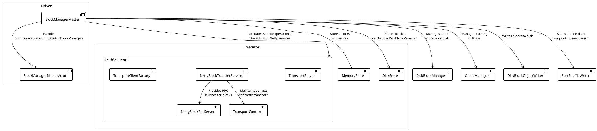
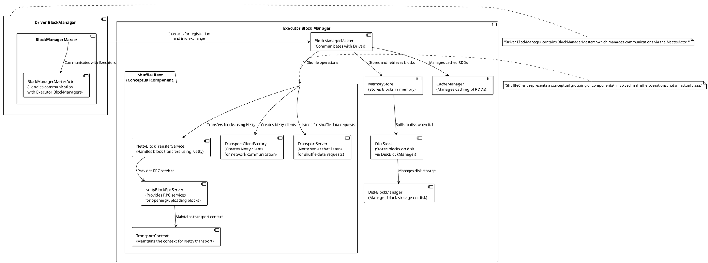

Let's correct the PlantUML diagram to accurately represent the relationships and include the missing elements:

In this revised version, we now correctly represent the `BlockManagerMaster` within the Executor BlockManager and clarify the `ShuffleClient` as a conceptual component that includes the network-related classes from Chapter 4.2. The `ShuffleClient` interacts with the `NettyBlockTransferService`, which in turn interacts with the `NettyBlockRpcServer` and `TransportContext`. The communication between the `BlockManagerMasterActor` on the Driver and the `BlockManagerMaster` on the Executor is also implied.

Certainly! To clarify the structure and avoid messiness in the PlantUML diagram, I'll structure it as requested, focusing on two main parts — the Driver and the Executor — and within the Executor, I'll include the ShuffleClient (as a conceptual component) and the rest of the BlockManagers. Here's the updated PlantUML code:

This code should generate a PlantUML diagram with a clearer representation. The Driver and Executor are depicted as two separate parts, with connections between them to indicate communication paths. The `ShuffleClient` within the Executor is shown as a package containing related Netty components to represent its conceptual nature.
