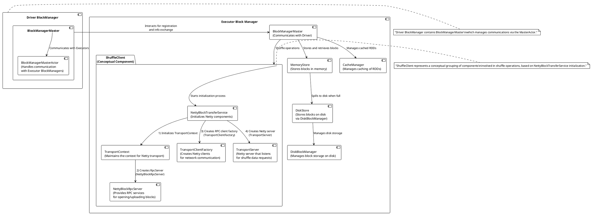

Certainly! Let's incorporate `NettyBlockTransferService` into the `ShuffleClient` package and show its role in initializing other components such as `TransportContext`, `TransportClientFactory`, and `TransportServer`.

Here's the updated PlantUML code reflecting the changes:

This updated diagram now explicitly includes `NettyBlockTransferService` within the `ShuffleClient` package to reflect that it is the central component that starts the initialization process of Netty-related components. The sequence numbers show the order of initialization as per the provided code snippet, ensuring `TransportContext` is created before `RpcServer` (`NettyBlockRpcServer`) and other Netty components (`TransportClientFactory` and `TransportServer`).

-----

The updated PlantUML diagram describes the structural relationship between the components involved in block management and shuffle operations in a Spark application. Here's a detailed explanation:

- **Driver BlockManager**: This is a central component within the Spark driver node. It houses the `BlockManagerMaster`, which is responsible for managing and coordinating block-related operations across all executors.

- **BlockManagerMaster**: Found within the Driver BlockManager, it orchestrates the storage and retrieval of blocks across different Spark executors. This component is crucial for the driver's ability to manage the entire cluster's storage resources efficiently.

- **BlockManagerMasterActor**: A sub-component of BlockManagerMaster, this actor handles all communication with the BlockManagers of the executors. It's through this actor that the master sends commands and receives updates regarding block status.

- **Executor Block Manager**: This represents an executor's local block manager, which interacts with the driver's `BlockManagerMaster` to register itself and exchange information about block storage.

- **BlockManagerMaster (Executor Side)**: Similar to the driver's BlockManagerMaster but specific to an executor, this component communicates with the driver to synchronize the state of the blocks.

- **MemoryStore**: It's part of the Executor Block Manager, holding blocks that are stored in the memory of the executor for fast access.

- **DiskStore**: Another component of the Executor Block Manager, which handles blocks that are spilled over to disk when the memory is insufficient.

- **DiskBlockManager**: Manages the actual storage of blocks on the disk. It interfaces with DiskStore to place and retrieve blocks.

- **CacheManager**: Responsible for managing the caching mechanism of RDDs within an executor. It optimizes storage and access patterns based on computation requirements.

- **ShuffleClient**: A conceptual group of components that deal with shuffle operations. It's not a literal class but represents the collective functionality of several classes involved in shuffle data transfers and operations.

- **NettyBlockTransferService**: It serves as the initiator of the shuffle service initialization process. It sets up the necessary components for Netty's network operations.

- **TransportContext**: Maintained by `NettyBlockTransferService`, this component provides the context required for Netty's transport operations, such as setting up the network connection parameters and codecs for serialization and deserialization of messages.

- **TransportClientFactory**: Produced by `NettyBlockTransferService`, it creates instances of Netty clients that are used for network communication, enabling executors to connect to each other and exchange shuffle data.

- **TransportServer**: Also set up by `NettyBlockTransferService`, this Netty server component listens for incoming network requests from other executors needing to perform shuffle operations.

- **NettyBlockRpcServer**: A specialized RPC server that provides remote procedure call services for tasks like opening or uploading blocks. It is initialized by `TransportContext` as part of the Netty framework.

The diagram also features notes that clarify the Driver BlockManager's role in communication across the Spark cluster and emphasize the conceptual nature of the ShuffleClient as a collection of network-related components within the executor.
