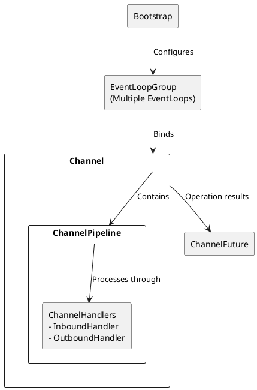

Absolutely! Let's break down these Netty components, focusing on simple analogies and their purpose within a Netty network application.

**1. Bootstrap**

- **Analogy:** The construction foreman responsible for setting up your project.
- **Functionality:** Configures your Netty application (server or client-side). It determines things like:
  - Type of transport (TCP, UDP, etc.)
  - Number of worker threads
  - Which Channel type to use
  - Options like connection timeouts

**2. EventLoopGroups**

- **Analogy:** A team of workers handling different tasks on your construction site.
- **Functionality:** Contain one or more EventLoops. Here's what an EventLoop does:
  - Handles network events (connections, data received, etc.)
  - Executes tasks on the ChannelPipeline (see below)

**3. Channel**

- **Analogy:** A "tunnel" or pipe through which data flows between your application and the network.
- **Functionality:** Represents a single open connection. You read from and write data to a Channel. Think of it as your communication lifeline.

**4. ChannelPipeline**

- **Analogy:** An assembly line within your factory.
- **Functionality:** A sequence of ChannelHandlers (see below) that process network events flowing through the Channel. Each handler has a specialized role.

**5. Handlers (ChannelHandlers)**

- **Analogy:** Individual workers on the assembly line, each with a specific job.
- **Functionality:**
  - **Inbound Handlers:** Process incoming data (decoding messages, handling business logic).
  - **Outbound Handlers:** Process outgoing data (encoding messages, writing to the network).

**6. ChannelFuture**

- **Analogy:** A delivery receipt.
- **Functionality:** Netty operations are asynchronous. A ChannelFuture lets you know if an operation (like connecting or writing data) was successful. You can get notified when it's complete.

**How It All Works Together (Simplified)**

1. **Bootstrap** sets the stage for your server or client.
2. **EventLoopGroups** provide the workers to handle the workload.
3. A **Channel** is created for each new connection.
4. The **ChannelPipeline** has a team of **Handlers** ready to process data traveling in and out of the channel.
5. **ChannelFutures** let your application know when network operations are finished.

Absolutely! Here's a concise slide focusing on the core ideas:

**Title: Building Blocks of a Netty Application**

- **Bootstrap:** Configures your Netty server or client.
- **EventLoopGroups:** Teams of workers handling network events and tasks.
- **Channel:** A communication pipe between your application and the network.
- **ChannelPipeline:** An assembly line of handlers processing data within a channel.
- **Handlers:** Specialized workers decoding incoming messages, encoding outgoing data, and performing application logic.
- **ChannelFuture:** Provides feedback on the success of asynchronous network operations.

The PlantUML script you've provided does a good job of illustrating the basic components of Netty's architecture and their relationships. However, there are some nuances and details about how these components interact within Netty that could be adjusted for clarity and accuracy:

1. **EventLoopGroups and EventLoops**:
   
   - `EventLoopGroups` manage a collection of `EventLoop` instances, not just a single one. Each `EventLoop` can handle multiple `Channels`, but a single `Channel` is bound to only one `EventLoop` for its lifetime.

2. **Channel and ChannelPipeline Relationship**:
   
   - Every `Channel` has exactly one `ChannelPipeline`, and this relationship is more of a composition than a sequence of interactions. The `ChannelPipeline` inherently exists within a `Channel`.

3. **ChannelPipeline and Handlers**:
   
   - The `ChannelPipeline` contains a chain of `ChannelHandler`s, which can be both inbound and outbound. The diagram might imply a linear progression from inbound to outbound, but in reality, handlers are arranged in a pipeline, and data can flow in both directions depending on the handler type (inbound for processing incoming data, outbound for processing outgoing data).

4. **ChannelFuture and Operations**:
   
   - `ChannelFuture` is more closely related to operations initiated on the `Channel`, such as connect, write, or close operations. It's used to notify the application of the operation's success or failure. Thus, `ChannelFuture` should be depicted as the outcome of operations on a `Channel`, not directly linked to the `Channel`.

Given these considerations, a revised PlantUML script might look like this:

This revised script emphasizes:

- The one-to-many relationship between `EventLoopGroup` and `EventLoop`s.
- The composition relationship between `Channel` and `ChannelPipeline`.
- The inclusion of both inbound and outbound handlers within the `ChannelPipeline`.
- The role of `ChannelFuture` in relation to operations performed on `Channel`.

These adjustments offer a clearer view of how Netty components interact, reflecting the architecture's flexibility and the framework's event-driven nature.

This revised script emphasizes:

- The one-to-many relationship between `EventLoopGroup` and `EventLoop`s.
- The composition relationship between `Channel` and `ChannelPipeline`.
- The inclusion of both inbound and outbound handlers within the `ChannelPipeline`.
- The role of `ChannelFuture` in relation to operations performed on `Channel`.

These adjustments offer a clearer view of how Netty components interact, reflecting the architecture's flexibility and the framework's event-driven nature.

The revised PlantUML diagram represents the architecture and flow of operations within a Netty application, detailing how various components interact from configuration to operation outcomes. Here's a description of the flow depicted in the graph:

1. **Bootstrap Configuration**: The process begins with the Bootstrap component, which is responsible for configuring the Netty server or client. Bootstrap is the starting point of a Netty application, setting up the necessary environment for network communication.

2. **EventLoopGroup Assignment**: The Bootstrap configures and assigns an EventLoopGroup to the server or client. An EventLoopGroup is essentially a group of EventLoops, and it manages the lifecycle of these loops, which are responsible for handling network events and tasks. The EventLoopGroup facilitates the handling of multiple concurrent connections efficiently by distributing them across multiple EventLoops.

3. **Channel Initialization**: Each connection in Netty is represented by a Channel, which serves as the communication pipe between the application and the network. A Channel is bound to a specific EventLoop for its entire lifecycle, ensuring that all operations for that connection are managed by the same EventLoop. This binding is depicted in the diagram by the link from the EventLoopGroup to the Channel, indicating that Channels are managed within the context of EventLoopGroups.

4. **ChannelPipeline Composition**: Within each Channel, there exists a ChannelPipeline. The ChannelPipeline is composed of a series of ChannelHandlers, which process inbound and outbound data. This pipeline functions as an assembly line, where data passes through each handler for processing. Handlers can be either inbound (for processing incoming data) or outbound (for handling outgoing data), and they are responsible for tasks such as decoding incoming messages, encoding outgoing messages, and executing application logic.

5. **ChannelFuture for Operation Feedback**: Operations performed on a Channel, such as connecting, writing, or closing, are asynchronous in nature. The ChannelFuture component provides feedback on the success or failure of these operations. When an operation is initiated, a ChannelFuture instance is returned, allowing the application to register listeners to receive notification of the operation's completion and its outcome.

The flow from Bootstrap configuration through to the feedback provided by ChannelFuture illustrates the lifecycle and data flow within a Netty application. This architecture enables efficient handling of network events, simplification of network programming, and effective management of asynchronous operations, making Netty a powerful framework for developing high-performance network applications.
