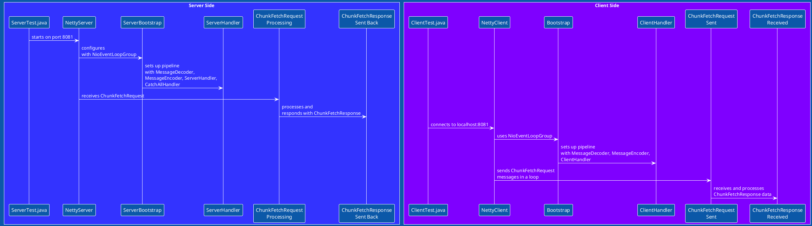

# 1st version of the design of Netty Application on chunkedfetch

Certainly! Here's a textual representation of the execution flow for `ServerTest.java` and `ClientTest.java`:

```
+-----------------+             +-------------------+
| ServerTest.java |             | ClientTest.java   |
+-----------------+             +-------------------+
        |                                  |
        | Starts                           | Waits for server to start
        | NettyServer                      | (with a brief sleep)
        v                                  v
+---------------------+             +---------------------+
| new NettyServer(8081)|             | new NettyClient     |
| .start();            |             | ("localhost", 8081) |
+---------------------+             +---------------------+
        |                                  |
        | Listens on port 8081             | Connects to server
        | for incoming connections         | on port 8081
        v                                  v
+---------------------+             +---------------------+
| Accepts connections |             | Sends fetch requests |
| and handles requests|             | for chunks using     |
| using ServerHandler |             | sendFetchRequest     |
+---------------------+             +---------------------+
        |                                  |
        | Processes ChunkFetchRequest      | Receives ChunkFetchResponse
        | and responds with                | and processes data
        | ChunkFetchResponse               |
        v                                  v
+---------------------+             +---------------------+
| Closes connection on|             | Continues to send   |
| server shutdown     |             | requests or closes  |
|                     |             | on completion       |
+---------------------+             +---------------------+
```

This flow showcases the interaction between a server and a client within a Netty application. The server initializes and starts listening for connections on a specified port, while the client connects to the server and begins sending fetch requests. The server processes these requests and sends back responses, which the client then processes. The operation continues until the client stops sending requests or the server shuts down, leading to connection closure.

# 2nd version of the design of Netty Application on chunkedfetch

Sure, let's incorporate the key components from the `NettyServer`, `ServerHandler`, `NettyClient`, and `ClientHandler` classes into the flow described previously. This will provide a more detailed overview of how these components interact within the context of the server and client tests.

```
+---------------------------------+       +----------------------------------+
| ServerTest.java                 |       | ClientTest.java                  |
| - Starts NettyServer on port 8081|       | - Creates NettyClient connected  |
|                                  |       |   to localhost:8081              |
+---------------------------------+       +----------------------------------+
            |                                          |
            | NettyServer: Starts listening           | NettyClient: Connects and
            | on port 8081 with ServerBootstrap       | begins sending ChunkFetchRequest
            | configured with:                        | messages in a loop
            | - NioEventLoopGroup for boss and worker | - Uses Bootstrap with NioEventLoopGroup
            | - ChannelInitializer to set up pipeline | - ChannelInitializer sets up pipeline
            |   with MessageDecoder, MessageEncoder,  |   with MessageDecoder, MessageEncoder,
            |   ServerHandler, and CatchAllHandler    |   and ClientHandler
            v                                          v
+-----------------------------------+     +-----------------------------------+
| ServerHandler: Handles incoming   |     | ClientHandler: Handles incoming   |
| ChunkFetchRequest messages.       |     | ChunkFetchResponse messages.      |
| Generates ChunkFetchResponse and  |     | Displays chunk data received.      |
| writes it back to the client.     |     |                                    |
+-----------------------------------+     +-----------------------------------+
            |                                          |
            | ChunkFetchRequest processed and         | ChunkFetchResponse received and
            | ChunkFetchResponse sent back           | data is processed
            v                                          v
+-----------------------------------+     +-----------------------------------+
| Server continues listening for   |     | Client continues to send requests |
| more requests or shuts down on   |     | or shuts down if specified         |
| command.                         |     | condition is met.                  |
+-----------------------------------+     +-----------------------------------+
```

This enhanced flow diagram now includes the specific classes involved at each step and briefly describes what happens during the server and client test executions. The `ServerBootstrap` and `Bootstrap` classes play a crucial role in setting up the server and client, respectively, including the configuration of their channel pipelines with appropriate handlers. The `ServerHandler` and `ClientHandler` are responsible for processing the received messages and acting accordingly, demonstrating a simple yet effective communication flow between a server and a client within a Netty application.

# PlantUML graph code

Certainly! Here's how the described textual graph can be converted into a PlantUML diagram:



This PlantUML diagram visualizes the execution flow from the server test (`ServerTest.java`) starting the `NettyServer` to the client test (`ClientTest.java`) sending fetch requests and handling the responses. It includes the initialization and configuration phases for both server and client, the processing of requests by the server, and the reception and processing of responses by the client.
